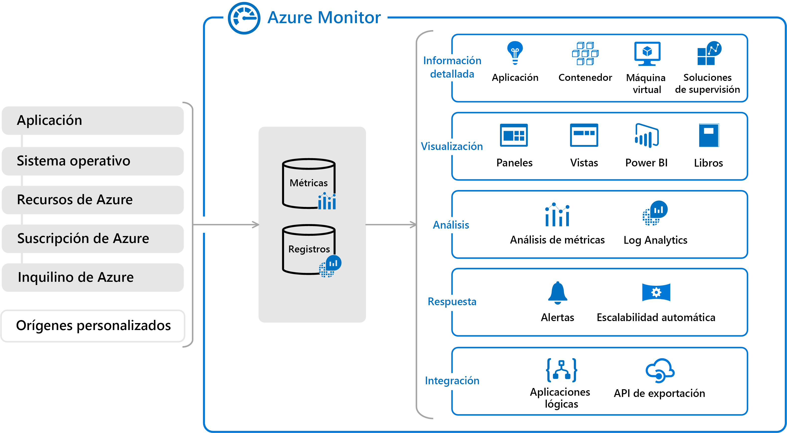
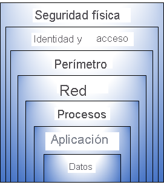

# Presentación

- 👋 Hola, Soy @MartinFacorro
- 👀 Me interesa muchísimas cosas, dentro de la tecnología, soy un programador apasionado. Me gusta mucho trabajar en equipo, observar cómo se trabaja y entender el valor del capital humano. En otros ordenes de la vida, me gusta mucho la lectura, no puedo vivir sin estar con un libro en la mano. Su tuviese que recomendar un libro, ese seria "El Mundo de Sofia" una novela de Jostein Gaarder.
- 🌱 Actualmente estoy aprendiendo sobre la nube por supuesto, y continuamente aprendiendo sobre temás de desarrollo.
- 💞️ Estoy buscando colaborar en la comunidad de Desarrolladores.
- 📫 Cómo llegar a mí, podras encontrarme en:
  - Twitter <a href="https://twitter.com/FacorroMartin"> @FacorroMartin </a> 
  - LinkedIn <a href="https://www.linkedin.com/in/martin-facorro/"> Martin Facorro </a>
  - Facebook <a href="https://www.facebook.com/profile.php?id=100080665428602"> Martin Facorro </a>
  - Instagram <a href="https://www.instagram.com/facorro.martin/"> Martin Facorro </a>
  - Github <a href="https://github.com/MartinFacorro"> Martin Facorro </a>

# Preparación Azure AZ-900 español

En este camino del aprendizaje, mientras lo recorro, quiero compartir aquellos recursos que me sirven al momento de prepararme.

El objetivo es dar un aporte para vuestros caminos.

Como primer ítem a compartir. Como cada documentación que uno requiera recorrer, el mejor lugar donde encontrar información es en el site oficial.
Por lo que para iniciar el primer lugar para visitar es el siguiente: <a href="https://docs.microsoft.com/es-mx/learn/azure/"> Azure en Microsoft Learn | Microsoft Docs</a>

A saber, el examen de AZ-900 consta de los siguientes temás.
Este examen incluye seis áreas de dominios de conocimiento:

|                                **Área de domínio AZ-900**                | **Peso**              |
|--------------------------------------------------------------------------|-----------------------|
|                  Descripción de los conceptos de la nube                 | 20-25 %               |
|              Descripción de los servicios básicos de Azure               | 15-20 %               |
|Descripción de las principales soluciones y herramientas de administración de Azure | 10-15 %     |
| Descripción de las características de seguridad general y de seguridad de red | 10-15 %          |
|Descripción de las características de identidad, gobernanza, privacidad y cumplimiento | 20-25 %  |
|Descripción de los Acuerdos de Nivel de Servicio y la administración de costos de Azure | 10-15 % |

#  Módulo 1 Conceptos de la nube

**cómputo en la nube**: prestación de servicios de cómputo a través de internet, permite el acceso bajo demanda a un grupo de recursos. Permite innovación más rápida, recursos flexibles y costos regulables.

## Modelos en la nube

### Nube privada

- Centro de datos propio
- La organización es responsable de operar los servicios que brinda.
- No proporciona accesos ajenos a la organización.

### Nube Publica

- Propiedad del Cloud Services o proveedor de hosting
- Proporciona recursos y servicios a múltiples organización y usuarios.
- Se accede a través de una red segura(por lo general internet).

### Nube híbrida

- Combina la nube publica con la privada.
- Permite la ejecución de aplicaciones de manera más adecuada.
- Se adecua, con legislaciones o regulaciones de información sensible, para que se mantenga en ubicaciones on-premise.

## Beneficios de la nube

- **Alta disponibilidad**: Capacidad que tienen las infraestructuras para mantenerse funcionando la mayor cantidad de tiempo posible, sin perjudicar la operación.

- **Tolerancia a fallos**: Capacidad de responder a una falla, sin generar la caída completa de los sistemas.

- **Escalabilidad**: Capacidad de agregar instancias o crecer verticalmente, por ejemplo, en la cantidad de máquinas virtuales para operar un sistema. (se realiza de forma manual o automática)

- **Elasticidad**: Capacidad de crecer horizontalmente, en este caso se incrementan los recursos de cómputo a un servicio o sistema. (se realiza de forma manual o automática)

- **Alcance global**: Esta relacionado con las capacidades de latencia por el lado del cliente. Relacionado a regiones, países. 

- **Capacidades de latencia del cliente**: Permite levantar servicios en la ubicación geográfica más cercada, en donde los usuarios los están consumiendo.

- **Agilidad**: Capacidad de generar o eliminar un recurso, un sistema de manera rápida y eficiente en el momento que lo creamos conveniente.

- **Consideraciones de costos predictivo**: Calculadora de costos, costos de capital.

## Costos de capital (Capex) (modelo on-premise)

- Gasto inicial de dinero en infraestructura física.
- Costos derivados de CapEx tienen un valor que se reduce con el tiempo.

## Gastos Operativos (OpEx)

- El gasto y la facturación en servicios o productos según sea necesario.
- Los gastos se deducen el mismo año.

## Modelo basado en el consumo

Los usuarios finales solo pagan por los recursos que utilizan.

- Mejor predicción de costos.
- Se proporcionan precios para recursos y servicios individuales.
- La facturación se basa en uso real.

## Servicios en la nube

### **Infraestructura como Servicio: (IaaS)**

Estructura más básica, el proveedor se ocupa de la planta física, de la seguridad, seguridad de red, proveen los servidores y almacenamiento.

### **Plataforma como servicio  (PaaS):**

Proporciona un entorno para desarrollar, probar e implementar aplicaciones, sin centrarse en la administración de la infraestructura subyacente.

Se utiliza para poder desarrollar, implementar software, si preocupaciones sobre la infraestructura.

### **Software como Servicio (Saas):**

Los usuarios usan aplicaciones basadas en la nube y se conectan a ellas a través de Internet. Algunos ejemplos: Microsoft 365, correo electrónico, calendario. Aplicaciones 100% en la nube.

### Modelo de Responsabilidad compartida.

La responsabilidad de acceso y de datos siempre es responsabilidad del cliente.

### Comparación de servicios en la nube

### Modelo de Responsabilidad compartida

### ServerLess o cómputo sin servidor

Con el modelo de cómputo sin servidor, el proveedor de servicios en la nube otorga, escala y administra de manera automática, la infraestructura para ejecutar el código.

**Azure Functions: (Se necesita un desarrollador)** 

 

Funciones que se ejecutan como servicios. Ejecución en tiempo real, donde se crea el recurso, se utiliza y se desecha. La VENTAJA es el costo, ya que se paga por lo que se consume.  Las funciones se usan normalmente cuando se debe realizar un trabajo en respuesta a un evento (a menudo a través de una solicitud REST), un temporizador o un mensaje de otro servicio de Azure, y cuando ese trabajo puede completarse rápidamente, en segundos o en menos tiempo.

Ventajas:

- En lugar de escribir una aplicación completa, el desarrollador crea una función, la cual contiene código y metadatos sobre sus desencadenadores y enlaces. La plataforma programa automáticamente la función para que se ejecute y escala el número de instancias de proceso según la tasa de eventos de entrada.
- Permite código más productivo.
- Lenguajes de desarrollo como C#, F#, Node.js, Java o PHP.
- Pagar solo por el tiempo en que Azure Functions esta en ejecución.

**Azure Logic Apps: (No requiere desarrollador)** 

Las aplicaciones lógicas ejecutan flujos de trabajo diseñados para automatizar escenarios empresariales y compilados a partir de bloques lógicos predefinidos. Todos los flujos de trabajo de aplicación lógica de Azure comienzan con un desencadenador, que se activa cuando se produce un evento específico o cuando hay nuevos datos disponibles que cumplen determinados criterios. Con el lanzamiento de un desencadenador, el motor de Logic Apps crea una instancia de aplicación lógica que ejecuta las acciones del flujo de trabajo.

Estas acciones también pueden incluir conversiones de datos y controles de flujo, como instrucciones condicionales, instrucciones "switch", bucles y bifurcaciones.

Los flujos de trabajo se conservan como un archivo JSON con un esquema de flujo de trabajo conocido.

Azure Logic Apps es un servicio sin código o de poco código, no se necesitan desarrolladores. Un profesional de la nube o de TI debe pueden compilar y dar soporte a este flujo de trabajo.

**Comparación entre Functions y Logic Apps**

Functions y Logic Apps pueden crear orquestaciones complejas. Una orquestación es una colección de funciones o pasos que se ejecutan para realizar una tarea compleja.

- Con Functions, se escribe código para completar cada paso.
- Con Logic Apps, se usa una GUI para definir las acciones y cómo se relacionan entre sí.

Puede mezclar y combinar servicios cuando crea una orquestación, llamando a las funciones desde las aplicaciones lógicas y viceversa. Aquí se indican algunas diferencias comunes entre las dos.

# Módulo 2 Conceptos de la nube

## Componentes de Arquitectura

### Regiones

Es un conjunto de centros de datos, cada región tiene mas de un data center. Esto permite flexibilidad para los usuarios, ya que reduce la latencia para los clientes. Pudiendo elegir las zonas de mayor proximidad. Las regiones y zonas de disponibilidad de Azure están diseñadas para ayudarle a lograr resistencia y confiabilidad en las cargas de trabajo críticas para la empresa.

### Par de regiones
Cada región de Azure se empareja siempre con otra región de la misma zona geográfica (por ejemplo, EE. UU., Europa o Asia) que se encuentre como mínimo a 500 km de distancia. Este enfoque permite la replicación de recursos, como el almacenamiento en la máquina virtual, en una zona geográfica, lo que ayuda a reducir la probabilidad de que se produzcan interrupciones provocadas por eventos como desastres naturales, disturbios civiles, cortes del suministro eléctrico o interrupciones de la red física que afecten de forma simultánea a ambas regiones. Si una región de un par se ve afectada por un desastre natural, por ejemplo, los servicios conmutarán por error automáticamente a la otra región de su par de regiones.

Algunos pares de regiones de ejemplo en Azure son Oeste de EE. UU. y Este de EE. UU., o Sudeste Asiático y Asia Pacífico.

Ventajas adicionales de los pares de región:

+ Si se produce una gran interrupción de Azure, se da prioridad a una región de cada par para asegurarse de que al menos una se restaure lo más rápido posible para las aplicaciones hospedadas en ese par de regiones.
+ Las actualizaciones planeadas de Azure se implementan una a una en regiones emparejadas para minimizar el tiempo de inactividad y el riesgo de interrupción de la aplicación.
+ Los datos siguen residiendo en la misma zona geográfica que su pareja (excepto Sur de Brasil) con fines de jurisdicción fiscal y de aplicación de la ley.

**Regiones Pareadas** a través La norma ISO22000 habla de la continuidad de negocios y recuperacion de desastres.
para cada región, existe una región par, a menos de 300 millas de distancia de la región original. Esto existe, para que haya replicación pares. Así ante un eventual caída, se recupere la información de la region par.

### Zonas de disponibilidad

A fin de proteger la información en caso de error, deberá asegurarse de que los servicios y datos son redundantes. Si hospeda su infraestructura, configurar su propia redundancia requiere la creación de entornos de hardware duplicados. Azure puede ayudar a que la aplicación tenga alta disponibilidad a través de zonas de disponibilidad.

### ¿Qué es una zona de disponibilidad?

Las zonas de disponibilidad son centros de datos separados físicamente dentro de una región de Azure. Cada zona de disponibilidad consta de uno o varios centros de datos equipados con alimentación, refrigeración y redes independientes. Una zona de disponibilidad se configura para constituir un límite de aislamiento. Si una zona deja de funcionar, la otra continúa trabajando. Las zonas de disponibilidad están conectadas a través de redes de fibra óptica de alta velocidad privadas.

Las zonas de disponibilidad son principalmente para las máquinas virtuales, los discos administrados, los equilibradores de carga y las bases de datos SQL. Las siguientes categorías de servicios de Azure admiten zonas de disponibilidad:

+ Servicios de zona: ancle el recurso a una zona específica (por ejemplo, máquinas virtuales, discos administrados, direcciones IP).
+ Servicios de redundancia de zona: la plataforma se replica automáticamente entre zonas (por ejemplo, almacenamiento con redundancia de zona, SQL Database).
+ Servicios no regionales: los servicios siempre están disponibles en regiones geográficas de Azure y son resistentes a las interrupciones de toda la zona, así como a las de toda la región.

### Jerarquía vertical de la organización
### Azure Resources Manager

### Grupos de Administración

Estos grupos le ayudan a administrar el acceso, las directivas y el cumplimiento de varias suscripciones. Todas las suscripciones de un grupo de administración heredan automáticamente las condiciones que se aplican al grupo de administración.

Se puede tener hasta 10mil niveles de administración, y 6 niveles.

### Suscripciones

Una suscripción agrupa las cuentas de usuario y los recursos que han creado esas cuentas de usuario. Para cada suscripción, hay límites o cuotas en la cantidad de recursos que se pueden crear y usar. Las organizaciones pueden usar las suscripciones para administrar los costos y los recursos creados por los usuarios, equipos o proyectos.

### Grupos de Recursos
Los recursos se combinan en grupos de recursos, que actúan como contenedor lógico en el que se implementan y administran recursos de Azure como aplicaciones web, bases de datos y cuentas de almacenamiento. Todos los recursos deben estar en un grupo de recursos, y un recurso solo puede ser miembro de un único grupo de recursos. Muchos recursos pueden moverse entre grupos de recursos con algunos servicios que tengan limitaciones o requisitos determinados para mover. Los grupos de recursos no se pueden anidar. Antes de poder aprovisionar un recurso, necesita un grupo de recursos en el que colocarlo.

### Recursos
Los recursos son instancias de servicios que puede crear, como máquinas virtuales, almacenamiento o bases de datos SQL.

### Recursos principales

Los recursos de Azure son los componentes como almacenamiento, maquinas virtuales,  y redes que están disponibles para crear soluciones en la nube.

1. Maquinas Virtuales.
2. Cuentas de almacenamiento.
3. Redes Virtuales.
4. App Services.
5. SQL Database.
6. Funciones.

### Cómputo (Azure Compute Services)

Es el servicio mas utilizado. Es un servicio de computo bajo demanda que proporciona recursos de computo como discos, procesadores, memoria, redes y sistemas operativos.

#### Maquinas virtuales

Las maquinas virtuales de Azure, son emulaciones basadas en software de equipos físicos:

- Incluye un procesador virtual, memoria, almacenamiento y redes.
- Oferta de la IaaS que proporciona un control y una personalización total.

Al utilizar un cliente de escritorio remoto, puede usar y controlar la máquina virtual como si se estuviera sentado delante de ella.

#### Servicio de Aplicaciones (Application services)

Azure App Services es una plataforma totalmente administrada para crear, implementar y escalar aplicaciones web, y APIs rápidamente:

- Compatible con .NET, .NET Core, Node.js, Java, Python o PHP.
- Oferta de PaaS con requisitos de cumplimiento, seguridad y rendimiento de nivel empresarial.
- Puede satisfacer los exigentes requisitos de rendimiento, escalabilidad, seguridad y cumplimiento mientras usa una plataforma totalmente administrada para realizar el mantenimiento de la infraestructura. App Service es una oferta de plataforma como servicio (PaaS).

**Tipos de servicios de aplicaciones**

Con App Service, puede hospedar la mayoría de los estilos de servicio de aplicación más comunes, como los siguientes:

- **Aplicaciones web**: compatibilidad completa para hospedar aplicaciones web mediante ASP.NET, ASP.NET Core, Java, Ruby, Node.js, PHP o Python. Puede elegir Windows o Linux como sistema operativo del host.
- **Aplicaciones de API**: puede compilar API web basadas en REST mediante el lenguaje y el marco que prefiera. Se obtiene compatibilidad completa con Swagger y la posibilidad de empaquetar y publicar la API en Azure Marketplace. Las aplicaciones producidas se pueden consumir desde cualquier cliente basado en HTTP o HTTPS.
- **Trabajos web**: Se puede usar la característica WebJobs para ejecutar un programa (.exe, Java, PHP, Python o Node.js) o un script (.cmd, .bat, PowerShell o Bash) en el mismo contexto que una aplicación web, aplicación de API o aplicación móvil. Los puede programar o ejecutar un desencadenador. Los trabajos web suelen usarse para ejecutar tareas en segundo plano como parte de la lógica de aplicación.
- **Aplicaciones móviles**: Use la característica Mobile Apps de App Service a fin de compilar rápidamente un back-end para aplicaciones iOS y Android. Con unos pocos clics en Azure Portal, puede realizar lo siguiente:

- Almacenar los datos de aplicaciones móviles en una base de datos SQL basada en la nube.
- Autenticar a clientes con proveedores sociales comunes, como MSA, Google, Twitter y Facebook.
- Enviar notificaciones de inserción.
- Ejecutar lógica de back-end personalizada en C# o Node.js.

En el lado de la aplicación móvil, hay compatibilidad con el SDK para aplicaciones nativas de iOS y Android, Xamarin y React.

**App Service** controla la mayoría de las decisiones sobre la infraestructura que se tratan en el hospedaje de aplicaciones accesibles desde la web:

- La implementación y administración se integran en la plataforma.
- Los puntos de conexión se pueden proteger.
- Los sitios se pueden escalar rápidamente para controlar cargas de tráfico elevado.
- El equilibrio de carga integrado y el administrador de tráfico proporcionan alta disponibilidad.

Todos estos estilos de aplicación se hospedan en la misma infraestructura y comparten estas ventajas. Esto convierte a App Service en la elección ideal para hospedar aplicaciones orientadas a la web.

#### Contenedores (Azure Container Services)

Los contenedores de Azure son un entorno virtualizado ligero que no requiere administracion del sistema operativo y puede responder a los cambios bajo demanda:

- **Azure Container Instances**: una oferta de PaaS que ejecuta un contenedor en Azure son la necesidad de administrar una maquina virtual o servicios adicionales.
- **Azure Kubernetes Services**: un servicio completo con arquitecturas distribuidas y grandes volúmenes de contenedores.

Los contenedores son una excelente opción si quiere ejecutar varias instancias de una aplicación en un solo equipo host.

#### Escritorio Virtual de Windows

Windows Virtual Desktop es la virtualización de aplicaciones y escritorios que se ejecuta en la nube:

- Cree un entorno de virtualizacion de escritorio completo sin tener que ejecutar servidores de puerta de enlace adicionales.
- Publique grupos de hosts ilimitados para adaptarse a diversas cargas de trabajo.
- Reduzca los costos con recursos agrupados para múltiples sesiones.

Azure Virtual Desktop proporciona administración centralizada de la seguridad de los escritorios de los usuarios con Azure Active Directory (Azure AD). Puede habilitar la autenticación multifactor para proteger los inicios de sesión de los usuarios. También puede proteger el acceso a los datos mediante la asignación a los usuarios de controles de acceso basados en roles (RBAC) detallados.

Los datos y las aplicaciones se separan del hardware local y se ejecutan en un servidor remoto. Se reduce el riesgo de dejar los datos confidenciales en un dispositivo personal.

Las sesiones de usuario están aisladas en entornos de una o varias sesiones.

### Redes

Incluye una gama de opciones para conectar el mundo exterior a servicios y características de los centros de datos globales de Azure.

#### Azure Virtual Network (VNet)
Permite que los recursos de Azure se comuniquen entre si, con internet y con redes locales.
Una red de Azure se puede considerar una extensión de la red local con recursos que vincula otros recursos de Azure.

Las redes virtuales de Azure proporcionan las importantes funcionalidades de red siguientes:

- **Aislamiento y segmentación**: permite crear varias redes virtuales aisladas.
- **Comunicación con Internet**: Una máquina virtual en Azure se puede conectar a Internet de forma predeterminada.
- **Comunicación entre recursos de Azure**: los recursos de Azure para que se comuniquen entre sí de forma segura.
- **Comunicación con los recursos locales**: permiten vincular entre sí los recursos del entorno local y dentro de la suscripción de Azure. Existen tres mecanismos para lograr esa conectividad:

  - Redes virtuales privadas de punto a sitio.
  - Redes virtuales privadas de sitio a sitio.
  - Azure ExpressRoute.

- Enrutamiento del tráfico de red: De forma predeterminada, Azure enruta el tráfico entre las subredes de todas las redes virtuales conectadas, las redes locales e Internet.

- Filtrado del tráfico de red: Azure permiten filtrar el tráfico entre las subredes mediante:

 - Grupos de seguridad de red.
 - Aplicaciones Virtuales de red.

- Conexión de redes virtuales: uede vincular redes virtuales entre sí mediante el emparejamiento de red virtual. El emparejamiento permite que los recursos de cada red virtual se comuniquen entre sí. Estas redes virtuales pueden estar en regiones distintas, lo que permite crear una red global interconectada con Azure.

#### Virtual Private Network Gateway (VPN)

Se usa para enviar tráfico cifrado entre una red virtual de Azure y una ubicacion local a través de la internet pública. Se implementan para conectar entre sí dos o más redes privadas de confianza a través de una red que no es de confianza (normalmente, la red pública de Internet). El tráfico se cifra mientras viaja por la red que no es de confianza para evitar ataques de interceptación o de otro tipo.

#### Azure Express Route

Extiende las redes locales hacia Azure a traves de una conexion privada que facilita un proveedore de conexion.

### Almacenamiento (Azure Storage Services)

Servicio que puede usar para almacenar archivos, mensajes, tablas y otros tipos de información. Los clientes como sitios web, aplicaciones móviles, aplicaciones de escritorio y muchos otros tipos de soluciones personalizadas pueden leer y escribir datos en Azure Storage. Azure Storage también se usa en máquinas virtuales de infraestructura como servicio y en servicios en la nube de plataforma como servicio.

#### Contenedores de almacenamiento (Blob Storage)

Servicio de almacenamiento para objetos muy grandes, como archivos de vídeo o mapas de bits.
Los blobs no están limitados a formatos de archivo comunes. Un blob podría contener gigabytes de datos binarios transmitidos desde un instrumento científico, un mensaje cifrado para otra aplicación o datos en un formato personalizado para una aplicación que se está desarrollando. 

Blob Storage resulta ideal para lo siguiente:

- Visualización de imágenes o documentos directamente en un explorador.
- Almacenamiento de archivos para acceso distribuido.
- Streaming de audio y vídeo.
- Almacenamiento de datos para copia de seguridad y restauración, recuperación ante desastres y archivado.
- Almacenamiento de datos para el análisis en local o en un servicio hospedado de Azure.
- Almacenamiento de hasta 8 TB de datos para máquinas virtuales.

Los blobs se almacenan en contenedores, lo que ayuda a organizar los blobs en función de sus necesidades empresariales.

#### Disk Storage

Proporciona discos para que las maquinas virtuales, aplicaciones y otros servicios accedan y los utilicen.

#### Azure Files

Recursos compartidos de archivos que puede administrar como un servidor de archivos y acceder a ellos del mismo modo. Los recursos compartidos de Azure se pueden montar simultáneamente en implementaciones de Windows, Linux y macOS en la nube o locales. Las aplicaciones que se ejecutan en máquinas virtuales o servicios en la nube de Azure pueden montar un recurso compartido de almacenamiento de archivos para acceder a datos de archivos, del mismo modo que una aplicación de escritorio montaría un recurso compartido SMB normal.

Todos estos servicios comparten varias características:

- **Durabilidad** y alta disponibilidad con redundancia y la replicación.
- **Seguridad** mediante el cifrado automático y control de acceso basado en rol.
- **Escalabilidad** con un almacenamiento prácticamente ilimitado.
- **Administración** y control del mantenimiento y de cualquier problema crítico que pueda surgir.
- **Accesibilidad** desde cualquier parte del mundo a través de HTTP o HTTPS.

#### Niveles de acceso al almacenamiento
Los datos almacenados en la nube pueden crecer a un ritmo exponencial. Para administrar los costos de las crecientes necesidades de almacenamiento, resulta útil organizar los datos en función de atributos como la frecuencia de acceso y el período de retención planeada.  algunos datos se accede con frecuencia al principio de su duración, mientras que el acceso cae drásticamente a medida que envejecen los datos. Algunos datos permanecen inactivos en la nube y, después de que se almacenan, no se accede a ellos prácticamente nunca.

Azure proporciona varios niveles de acceso, que puede usar para equilibrar los costos de almacenamiento con sus necesidades de acceso.

- **Nivel de acceso frecuente**: optimizado para almacenar datos a los que se accede con frecuencia (por ejemplo, imágenes para el sitio web).
- **Nivel de acceso esporádico**: optimizado para datos a los que se accede con poca frecuencia y que se almacenan al menos durante 30 días (por ejemplo, las facturas de los clientes).
- **Nivel de acceso de archivo**: conveniente para datos a los que raramente se accede y que se almacenan durante al menos 180 días con requisitos de latencia flexibles (por ejemplo, copias de seguridad a largo plazo).

Las siguientes consideraciones se aplican a los distintos niveles de acceso:

- Solo los niveles de acceso frecuente y esporádico se pueden establecer en el nivel de cuenta. El nivel de acceso de archivo no está disponible en el nivel de cuenta.
- Los niveles frecuente, esporádico y de archivo se pueden establecer en el nivel de blob durante la carga o después de esta.
- Los datos del nivel de acceso esporádico pueden tolerar una disponibilidad ligeramente inferior, pero aun así requieren una gran durabilidad, una latencia de recuperación y unas características de rendimiento similares a las de los datos de acceso frecuente. En el caso de los datos de acceso esporádico, un contrato de nivel de servicio (SLA) con una disponibilidad ligeramente inferior y unos costos de acceso mayores, en comparación con los datos de acceso frecuente, es aceptable a cambio de unos costos de almacenamiento menores.
- El almacenamiento de archivo almacena datos sin conexión y ofrece los menores costos de almacenamiento, pero los mayores costos de acceso y rehidratación de datos.

### Bases de datos.

#### Azure Cosmos Database
 
Base de datos distribuida globalmente que admite opciones NoSQL. Puede escalar de forma elástica e independiente el rendimiento y el almacenamiento en cualquier número de regiones de Azure de todo el mundo. Puede aprovechar un acceso rápido y en milisegundos de un solo dígito a los datos mediante cualquiera de las diversas API populares. Azure Cosmos DB proporciona de forma exclusiva contratos de nivel de servicio completos para garantizar el rendimiento, la latencia, la disponibilidad y la coherencia.

Azure Cosmos DB es compatible con los datos sin esquema, lo que le permite compilar aplicaciones "Always On" con una gran capacidad de respuesta para admitir datos en continuo cambio.

Azure Cosmos DB es flexible. En el nivel más bajo, Azure Cosmos DB almacena los datos en formato de secuencia de registro de átomos (ARS). Después, los datos se abstraen y se proyectan como una API, que se especifica al crear la base de datos. Entre las opciones se incluyen SQL, MongoDB, Cassandra, Tables y Gremlin. Este nivel de flexibilidad implica que, al migrar las bases de datos de la empresa a Azure Cosmos DB, los desarrolladores pueden seguir con la API con la que se encuentren más cómodos.

#### Azure SQL Database

Base de datos relacional totalmente administrada con escalado automático, inteligencia integral y seguridad sólida.

SQL Database es una base de datos de alto rendimiento, confiable, totalmente administrada y segura. Puede usarla para compilar aplicaciones y sitios web controlados por datos en el lenguaje de programación que prefiera sin necesidad de administrar infraestructura.

Azure SQL Database es un motor de base de datos de plataforma como servicio (PaaS). Controla la mayoría de las funciones de administración de bases de datos, como las actualizaciones, las aplicaciones de revisiones, las copias de seguridad y la supervisión, sin intervención del usuario. SQL Database proporciona disponibilidad del 99,99 %. Las capacidades de PaaS que están integradas en SQL Database permiten centrarse en las actividades de administración y optimización de bases de datos específicas del dominio que son críticas para el negocio. No hace falta administrar la infraestructura subyacente.

SQL Database puede ser la opción adecuada para una variedad de aplicaciones modernas en la nube, porque le permite procesar tanto datos relacionales como estructuras no relacionales, por ejemplo, grafos, JSON, elementos espaciales y XML.

Puede migrar las bases de datos existentes de SQL Server con un tiempo de inactividad mínimo mediante Azure Database Migration Service. Microsoft Data Migration Assistant puede generar informes de evaluación que proporcionan recomendaciones para ayudarlo a través de los cambios necesarios anteriores a la ejecución de una migración. Después de evaluar y resolver cualquier corrección necesaria, está listo para comenzar el proceso de migración. Azure Database Migration Service realiza todos los pasos necesarios. 

#### Azure Database for MySQL

Base de datos relacional MySQL totalmente administrada y escalable con alta disponibilidad y seguridad.
Azure Database for MySQL es un servicio de bases de datos relacionales en la nube, y se basa en el motor de base de datos de MySQL Community Edition, versiones 5.6, 5.7 y 8.0. Con él, tiene un contrato de nivel de servicio de disponibilidad del 99,99 % de Azure.

Azure Database for MySQL ofrece lo siguiente:

+ Alta disponibilidad integrada sin coste adicional.
+ Rendimiento predecible y precios de pago por uso inclusivos.
+ Escalado según sea necesario, en cuestión de segundos.
+ Capacidad de protección de información confidencial en reposo y en movimiento.
+ Copias de seguridad automáticas.
+ Seguridad y cumplimiento de nivel empresarial.

#### Azure Database for PostgreSQL

Base de datos relacional PostgreSQL totalmente administrada y escalable con alta disponibilidad y seguridad.

Azure Database for PostgreSQL es un servicio de base de datos relacional en la nube. El software de servidor se basa en la versión de la comunidad del motor de base de datos de PostgreSQL de código abierto. Su familiaridad con las herramientas y la experiencia con PostgreSQL son aplicables cuando se use Azure Database for PostgreSQL.

Además, Azure Database for PostgreSQL ofrece las siguientes ventajas:

+ Alta disponibilidad integrada en comparación con los recursos locales. No hay ninguna configuración, replicación o costo adicionales que sean necesarios para asegurarse de que las aplicaciones están siempre disponibles.
+ Precios sencillos y flexibles. Tiene un rendimiento predecible en función de un plan de tarifa seleccionado que incluye copias de seguridad automáticas, aplicación de revisiones de software, supervisión y seguridad.
+ Escalado o reducción vertical según sea necesario, en cuestión de segundos. Puede escalar por separado proceso o almacenamiento según sea necesario para asegurarse de que adapta su servicio para que coincida con el uso.
+ Copias de seguridad automáticas ajustables y restauración a un momento dado durante un máximo de 35 días.
+ Seguridad y cumplimiento de nivel empresarial para proteger la información confidencial en reposo y en movimiento. Esta seguridad abarca el cifrado de datos en el disco y el cifrado SSL entre la comunicación entre cliente y servidor.

Azure Database for PostgreSQL está disponible en dos opciones de implementación: Servidor único e Hiperescala (Citus).

### Servidor único

La opción de implementación Un solo servidor ofrece:

+ Alta disponibilidad integrada sin coste adicional (contrato de nivel de servicio del 99,99 %).
+ Rendimiento predecible y precios de pago por uso inclusivos.
+ Escalado vertical según sea necesario, en cuestión de segundos.
+ Supervisión y alertas para evaluar el servidor.
+ Seguridad y cumplimiento de nivel empresarial.
+ Capacidad de protección de información confidencial en reposo y en movimiento.
+ Copias de seguridad automáticas y restauración a un momento dado durante un máximo de 35 días.

La opción de implementación Un solo servidor ofrece tres planes de tarifa: Básico, De uso general y Optimizado para memoria. Cada plan ofrece capacidades de recursos diferente para admitir sus cargas de trabajo de la base de datos. Puede compilar su primera aplicación en una base de datos pequeña por poco dinero al mes y, después, ajustar la escala para satisfacer las necesidades de la solución. La escalabilidad dinámica permite a la base de datos responder de manera transparente a los cambiantes requisitos de recursos. Solo paga por los recursos que necesite y cuando los necesite.

### Hiperescala (Citus)

La opción de Hiperescala (Citus) escala horizontalmente las consultas entre varias máquinas mediante el particionamiento. Su motor de consultas paraleliza las consultas SQL entrantes en estos servidores para agilizar las respuestas en conjuntos de datos grandes. Proporciona servicios a las aplicaciones que requieren mayor escala y mejor rendimiento, por lo general las cargas de trabajo que se aproximan a los 100 GB de datos (o que ya los superan).

La opción de implementación de Hiperescala (Citus) admite aplicaciones multiinquilino, análisis operativos en tiempo real y cargas de trabajo transaccionales de alto rendimiento. Las aplicaciones compiladas para PostgreSQL puede ejecutar consultas distribuidas en Citus con las bibliotecas de conexiones estándar y unos cambios mínimos.

#### Azure Database for MariaDB

Base de datos relacional MariaDB totalmente administrada y escalable con alta disponibilidad y seguridad.

#### SQL Server en Azure Virtual Machines

Servicio que hospeda aplicaciones empresariales de SQL Server en la nube.

#### Azure Synapse Analytics

Almacén de datos totalmente administrado con seguridad integral en todos los niveles de escala sin costo adicional.

#### Azure SQL Managed Instance

Permite a los clientes de SQL Server subir y trasladar sus aplicaciones locales a la nube con cambios mínimos en aplicaciones y la base de datos:

  - Plataforma como servicio totalmente administrada y permanente.
  - Conserva todas las capacidades de una PaaS (parches automáticos y actualizaciones de versiones, copias de seguridad automáticas y alta disponibilidad).
  - Intercambie licencias existentes por tarifas con descuento en SQL Managed Instance mediante Azure Hybrid Benefit.
  

Azure SQL Managed Instance facilita la migración de los datos locales en SQL Server a la nube con Azure Database Migration Service (DMS) o copias de seguridad y restauración nativas. Una vez que haya descubierto todas las características que usa la empresa, deberá evaluar qué instancias locales de SQL Server puede migrar a Azure SQL Managed Instance para ver si tiene algún problema de bloqueo. Una vez resueltas las incidencias, puede migrar los datos y, después, realizar la transferencia desde el servidor SQL Server local a la instancia de Azure SQL Managed Instance cambiando la cadena de conexión en las aplicaciones.

#### Móvil

Con Azure, los desarrolladores pueden crear servicios de back-end móviles para aplicaciones iOS, Android y Windows de forma rápida y sencilla. Las características que solían tardar tiempo y aumentaban los riesgos del proyecto, como la incorporación del inicio de sesión corporativo y la posterior conexión a recursos locales como SAP, Oracle, SQL Server y SharePoint, ahora se incluyen con facilidad.

Estas son otras características de este servicio:

- Sincronización de datos sin conexión.
- Conectividad a datos locales.
- Difusión de notificaciones de inserción.
- Escalado automático para satisfacer las necesidades del negocio.

#### WEB

En el mundo empresarial actual es fundamental tener una experiencia web excelente. Azure incluye soporte técnico de primera clase para compilar y hospedar aplicaciones web y servicios web basados en HTTP. Los siguientes servicios de Azure se centran en el hospedaje web.

**Azure App Service**: Creación rápida de aplicaciones en la nube eficaces basadas en web.

**Azure Notification Hubs**: Envíe notificaciones push a cualquier plataforma desde cualquier back-end.

**Azure API Management**: Publique API para desarrolladores, asociados y empleados de forma segura y a escala.

**Azure Cognitive Search**: Esta búsqueda completamente administrada se implementa como servicio.

**Característica Web Apps de Azure App Service**: Cree e implemente rápidamente aplicaciones web críticas a escala.

**Servicio Azure SignalR**: Agregue funcionalidades web en tiempo real con facilidad.

#### Azure MarketPlace

Permite a los clientes encontrar, probar, comprar y aprovisionar aplicaciones y servicios de cientos de proveedores de servicios lideres. Todos certificados para ejecutarse en Azure:

  * Plataformas de contenedores de código abierto.
  * Imágenes de bases de datos y maquinas virtuales.
  * Software de desarrollo e implementación de aplicaciones.
  * Herramientas de desarrollo.
  * y mas.

# Modulo 03 Soluciones principales

## Azure Internet of Things IoT
Esta capacidad de los dispositivos de obtener y luego retransmitir informacion para le analisis de datos, se conoce como IoT (Internet de las cosas).

Algunos sensores comunes que miden los atributos del mundo físico incluyen:

- Sensores de entorno que capturan los niveles de temperatura y humedad.
- Escáneres de códigos de barras, códigos QR o reconocimiento óptico de caracteres (OCR).
- Sensores de proximidad y ubicación geográfica.
- Sensores de luz, color e infrarrojos.
- Sensores de sonido y ultrasonido.
- Sensores táctiles y de movimiento.
- Sensores de inclinación y acelerómetros.
- Sensores de humo, gas y alcohol.
- Detectores de errores para determinar cuándo hay un problema con el dispositivo.
- Sensores mecánicos que detectan anomalías o deformaciones.
- Sensores de flujo, nivel y presión para medir gases y líquidos.

### Azure IoT Central
Es una solución global de IoT SaaS totalmente administrada que facilita la conexión, la supervisión y la administración de sus activos de IoT a gran escala. La interfaz de usuario (UI) visual facilita la conexión rápida de nuevos dispositivos y la inspección a medida que comienzan a enviar mensajes de telemetría o de error. Puede ver el rendimiento general de todos los dispositivos en conjunto y configurar alertas que envían notificaciones cuando un dispositivo concreto necesita mantenimiento.

### Azure IoT Hub
Es un servicio administrado hospedado en la nube que actua como un centro de mensajes central para la comunicación bidireccional entre aplicaciones IoT y los dispositivos que administra. También admite varios patrones de mensajería, como telemetría de dispositivo a la nube, carga de archivos desde dispositivos y métodos de solicitud-respuesta para controlar los dispositivos desde la nube. Una vez que un centro de IoT recibe los mensajes de un dispositivo, puede enrutarlos a otros servicios de Azure.

### Azure IoT Sphere

es una plataforma de aplicaciones segura de alto nivel con funciones de seguridad y comunicación integradas para dispositivos conectados a internet.
Azure Sphere consta de tres partes:
• La primera parte es la unidad de microcontrolador (MCU) de Azure Sphere, que se encarga de procesar el sistema operativo y las señales de los sensores conectados. 
• La segunda parte es un sistema operativo (SO) Linux personalizado, que controla la comunicación con el servicio de seguridad y puede ejecutar el software del proveedor.
• La tercera parte es el servicio de seguridad de Azure Sphere, también conocido como AS3. Su trabajo es asegurarse de que el dispositivo no se ha puesto en peligro de forma malintencionada. Cuando el dispositivo intenta conectarse a Azure, primero debe autenticarse, por dispositivo, mediante autenticación basada en certificado. Si se autentica correctamente, AS3 comprueba que el dispositivo no se haya alterado. Una vez que ha establecido un canal de comunicación seguro, AS3 inserta en el dispositivo las actualizaciones de software del sistema operativo o desarrolladas por el cliente (y aprobadas). Los datos se presentan en cualquier formato y tamaño. Cuando hablamos sobre macrodatos, nos referimos a grandes volúmenes de datos. Los datos de los sistemas del tiempo, sistemas de comunicaciones, investigación genómica, plataformas de imágenes y muchos otros escenarios generan cientos de gigabytes de datos. Esta cantidad de datos hace que resulte difícil analizar y tomar decisiones. A menudo es tan grande que las formas de procesamiento y análisis tradicionales ya no son adecuadas.

## Big Data y Analytics

Cuando hablamos sobre macrodatos, nos referimos a grandes volúmenes de datos. Con tal cantidad de datos, es cada vez más difícil comprenderlos y tomar decisiones basándose en ellos. Estos volúmenes son tan grandes que las formas de procesamiento y análisis tradicionales ya no son adecuadas.

**Azure Synapse Analytics**: Data Warehouse basado en la nube. Ejecute análisis a gran escala mediante un almacenamiento de datos empresarial basado en la nube que aprovecha las ventajas del procesamiento paralelo masivo para ejecutar rápidamente consultas complejas en petabytes de datos. Puede consultar los datos como prefiera mediante recursos sin servidor o aprovisionados a escala. Tiene una experiencia unificada para ingerir, preparar, administrar y servir datos para las necesidades inmediatas de inteligencia empresarial y aprendizaje automático.

**Azure HDInsight**: Servicio de análisis de código abierto, totalmente administrado. Procese grandes cantidades de datos con los clústeres administrados de Hadoop en la nube. También admite una amplia gama de escenarios, como la extracción, la transformación y la carga de datos (ETL), el almacenamiento de datos, el aprendizaje automático e IoT.

**Azure Databricks**: Servicio de análisis basado en Apache Spark. Integre este servicio de análisis colaborativo basado en Apache Spark con otros servicios de macrodatos en Azure. Le ayuda a descubrir información de todos los datos y a crear soluciones de inteligencia artificial. Puede configurar el entorno de Apache Spark en minutos y, después, escalar automáticamente y colaborar en proyectos compartidos en un área de trabajo interactiva. Azure Databricks admite Python, Scala, R, Java y SQL, así como marcos y bibliotecas de ciencia de datos, como TensorFlow, PyTorch y Scikit-learn.

**Azure Data Lake**: servicio de trabajos de análisis a petición que simplifica los macrodatos. En lugar de implementar, configurar y ajustar el hardware, puede escribir consultas para transformar los datos y extraer ideas valiosas. El servicio de análisis puede administrar trabajos de cualquier escala al instante, simplemente estableciendo el ajuste adecuado. Solo paga por su trabajo cuando se está ejecutando, lo que hace que sea más rentable.

## Inteligencia Artificial
 la inteligencia artificial se basa en una amplia gama de servicios, donde el principal es el aprendizaje automático. El aprendizaje automático es una técnica de ciencia de datos que permite a los equipos utilizar datos existentes para prever tendencias, resultados y comportamientos futuros. Mediante el aprendizaje automático, los equipos aprenden sin necesidad de programarlos explícitamente.
 Las previsiones o predicciones del aprendizaje automático pueden hacer que las aplicaciones y los dispositivos sean más inteligentes. 

**Azure Machine Learning Service**: Entorno basado en la nube que puede usar para desarrollar, entrenar, probar, implementar, administrar y realizar un seguimiento de los modelos de aprendizaje automático. Puede generar y ajustar automáticamente un modelo. Le permite comenzar a entrenar en el equipo local y luego escalar horizontalmente a la nube.

**Azure ML Studio**: Área de trabajo visual colaborativa donde puede compilar, probar e implementar soluciones de aprendizaje automático mediante algoritmos de aprendizaje automático predefinidos y módulos de control de datos.

**Cognitive Services**: es un conjunto de productos estrechamente relacionados. Puede usar estas API precompiladas en las aplicaciones para solucionar problemas complejos.
Azure Cognitive Services se puede dividir en las categorías siguientes:

- Servicios de **lenguaje**: permita que las aplicaciones procesen lenguaje natural con scripts precompilados, evalúen opiniones y aprendan a reconocer lo que quieren los usuarios.
- Servicios de **voz**: convierta voz en texto y texto en voz de sonido natural. Traduzca de un idioma a otro y habilite el reconocimiento y la verificación del hablante.
- Servicios de **visión**: agregue capacidades de reconocimiento e identificación al analizar imágenes, vídeos y otro contenido visual.
- Servicios de **decisión**: agregue recomendaciones personalizadas para cada usuario que mejoren automáticamente cada vez que se usen, modere contenido para supervisar y quitar el contenido ofensivo o arriesgado y detecte anomalías en los datos de series temporales.

**Azure Bot Service** Bot Framework son plataformas para crear agentes virtuales que comprenden y responden a preguntas como un ser humano. Azure Bot Service se diferencia de Azure Machine Learning y Azure Cognitive Services en que tiene un caso de uso concreto: crear un agente virtual que pueda comunicarse de forma inteligente con los usuarios. En segundo plano, el bot que crea usa otros servicios de Azure, como Azure Cognitive Services, para comprender lo que solicitan sus homólogos humanos.

Los bots se pueden usar para convertir tareas sencillas y repetitivas, como tomar una reserva de cena o recopilar información de perfil, en sistemas automatizados que ya no requieran la intervención humana directa. Los usuarios conversan con un bot mediante texto, tarjetas interactivas y voz. Una interacción con un bot puede ser tanto una pregunta y una respuesta rápidas como una conversación sofisticada que proporciona acceso a servicios de forma inteligente.

## ServerLess(Cómputo sin servidor).

ServerLess es una evolución de la nube, donde los programadores se pueden dedicar a programar sin preocuparse por la infraestructura del servidor. Se utiliza a partir de un Web Request. Se usa para describir un entorno de ejecución que se configura y administra de manera automática. El cliente tan solo debe escribir código o conectar y configurar los componentes en un editor visual y, después, especificar las acciones que desencadenan la funcionalidad, como un temporizador o una solicitud HTTP. Lo mejor de todo es que únicamente se paga en función del uso real del código y que no hay que preocuparse de las interrupciones, dado que el código puede hacer un escalado instantáneo para satisfacer la demanda.

**Azure Functions**: puede hospedar un único método o función mediante un lenguaje de programación popular en la nube que se ejecuta en respuesta a un evento. Un ejemplo de un evento podría ser una solicitud HTTP, un mensaje nuevo en una cola o un mensaje en un temporizador.

Por su naturaleza atómica, Azure Functions puede servir para muchos propósitos en el diseño de una aplicación. Las funciones se pueden escribir con muchos lenguajes de programación comunes, como C#, Python, JavaScript, Typescript, Java y PowerShell.
Azure Functions se escala automáticamente, y los cargos se acumulan solo cuando se desencadena una función. Estas características convierten a Azure Functions en una elección sólida cuando la demanda es variable. Por ejemplo, podría recibir mensajes de una solución de IoT que supervisa una flota de vehículos de reparto. Probablemente llegarán más datos durante el horario comercial. Azure Functions se puede escalar horizontalmente para adaptarse a esas horas de más trabajo.

Una función de Azure es un entorno sin estado. Una función se comporta como si se reiniciara cada vez que responde a un evento. Esta característica resulta muy conveniente para procesar los datos entrantes. Y si el estado es necesario, la función se puede conectar a una cuenta de almacenamiento de Azure.

Azure Functions puede realizar tareas de orquestación mediante una extensión llamada Durable Functions, que permite a los desarrolladores encadenar funciones al tiempo que se mantiene el estado.

**Azure Logic Apps**: es una plataforma de desarrollo de poco código o sin código hospedada como un servicio en la nube. El servicio le ayuda a automatizar y organizar tareas, procesos empresariales y flujos de trabajo cuando tiene que integrar aplicaciones, datos, sistemas y servicios en empresas u organizaciones. Logic Apps simplifica el diseño y la creación de soluciones escalables en la nube, en el entorno local o en ambos. Esta solución abarca la integración de aplicaciones, la integración de datos, la integración de sistemas, la integración de aplicaciones empresariales (EAI) y la integración de negocio a negocio (B2B).

Azure Logic Apps está diseñado en un entorno web y puede ejecutar una lógica que los servicios de Azure desencadenan sin escribir ningún código. Las aplicaciones se pueden compilar vinculando desencadenadores con acciones mediante conectores. Un desencadenador es un evento (como un temporizador) que hace que una aplicación se ejecute, que un mensaje nuevo se envíe a una cola o que se emita una solicitud HTTP. Una acción es una tarea o paso que se puede ejecutar. Hay acciones lógicas, como las que encontraría en la mayoría de los lenguajes de programación. Entre los ejemplos de acciones se incluyen trabajar con variables, instrucciones de decisión y bucles, y tareas que analizan y modifican datos.

**Diferencias**: Azure Functions es un servicio informático sin servidor, y Azure Logic Apps está diseñado para ser un servicio de orquestación sin servidor. Azure Functions es un servicio informático sin servidor, y Azure Logic Apps está diseñado para ser un servicio de orquestación sin servidor. 

## DevOps

DevOps reúne a individuos, procesos y tecnología mediante la automatización de la entrega de software para ofrecer un valor continuo a los usuarios. Con Azure DevOps puede crear, compilar y publicar canalizaciones que proporcionan integración, entrega e implementación continuas a las aplicaciones. Puede integrar los repositorios y las pruebas de aplicaciones, realizar la supervisión de aplicaciones y trabajar con artefactos de compilación. También puede trabajar con elementos de trabajo pendiente para realizar el seguimiento, automatizar la implementación de la infraestructura e integrar una gama de herramientas y servicios de terceros como Jenkins y Chef.

**GitHub**: Hosting de desarrollo de software con control de versiones, gestión de código fuente y administracion de errores y tareas.

**GitHub Actions for Azure**:

**Azure DevOps**: Use herramientas de colaboración de desarrollo como canalizaciones de alto rendimiento, repositorios Git privados gratuitos, paneles Kanban configurables y completas pruebas de carga basadas en la nube y automatizadas. Anteriormente conocido como Visual Studio Team Services.

**Azure DevOps Services** es un conjunto de servicios que aborda cada fase del ciclo de vida de desarrollo de software.

+ **Azure Repos** es un repositorio de código fuente centralizado en el que los profesionales de desarrollo de software, ingeniería DevOps y documentación pueden publicar su código para su revisión y colaboración.
+ **Azure Boards** es un conjunto de administración de proyectos ágil que incluye paneles Kanban, informes, ideas de seguimiento y trabajo desde epopeyas de alto nivel hasta incidencias y elementos de trabajo.
+ **Azure Pipelines** es una herramienta de automatización de canalizaciones de CI/CD.
+ **Azure Artifacts** es un repositorio para hospedar artefactos, como código fuente compilado, que se puede incluir en los pasos de canalización de pruebas o de implementación.
+ **Azure Test Plans** es una herramienta de pruebas automatizadas que se puede usar en una canalización de CI/CD para garantizar la calidad antes de publicar una versión de software.

**Azure DevTest Labs**: Cree rápidamente entornos de Windows y Linux a petición para probar o realizar demostraciones de las aplicaciones directamente desde canalizaciones de implementación.

## Herramientas de Administración de Azure

Azure Portal es una consola unificada basada en web que proporciona una alternativa a las herramientas de línea de comandos. Con Azure Portal, puede administrar la suscripción de Azure mediante una interfaz gráfica de usuario. Puede:

- Compile, administre y supervise todo, desde aplicaciones web sencillas hasta complejas implementaciones en la nube.
- Cree paneles personalizados para una vista organizada de recursos.
- Configure opciones de accesibilidad para una experiencia óptima.

**Herramientas de Administración**

- **Azure Portal**: interfaz de usuario basada en web, puede acceder a prácticamente todas las características de Azure. Azure Portal dispone de una UI gráfica sencilla en la que se pueden ver todos los servicios que se están usando, crear servicios nuevos, configurar los servicios y ver informes. Azure Portal es la primera experiencia para la mayoría de los usuarios de Azure. Aunque a medida que crece el uso Azure, es más probable que elijan un enfoque más fácil de repetir centrado en código para administrar los recursos de Azure.
- **Azure PowerShell**: shell que permite a los desarrolladores, y profesionales de TI y DevOps ejecutar comandos denominados cmdlets o command-lets. Estos comandos llaman a la API REST de Azure para realizar todas las tareas de administración posibles en Azure. Los cmdlets pueden ejecutarse de forma independiente o combinarse en un archivo de script y ejecutarse en conjunto para organizar:
	+ La configuración de rutinas, la anulación y el mantenimiento de un único recurso o de varios recursos conectados.
	+ La implementación de una infraestructura completa, que puede contener decenas o cientos de 	recursos, de código imperativo.
	+ La captura de los comandos en un script hace que el proceso se pueda repetir y automatizar.
- **Azure Mobile App**: le permite acceder a los recursos de Azure desde iOS y Android cuando no tiene el equipo a mano. Por ejemplo, puede:
	+ Supervisar el mantenimiento y el estado de sus recursos de Azure.
	+ Consultar alertas, diagnosticar y corregir problemas rápidamente, reiniciar una aplicación web o 	una máquina virtual (VM).
	+ Ejecutar comandos de la CLI de Azure o de Azure PowerShell para administrar los recursos de Azure.
- **Interfaz de la linea de comandos (CLI)**:  programa ejecutable que permite a un desarrollador, profesional de DevOps o profesional de TI ejecutar comandos en Bash. Estos comandos llaman a la API REST de Azure para realizar todas las tareas de administración posibles en Azure. Es posible ejecutar los comandos de forma independiente o combinados en un script, y ejecutarlos conjuntamente para la configuración de rutinas, la anulación y el mantenimiento de un único recurso o de un entorno completo. La principal diferencia (entre PowerShell o Bash) es la sintaxis que se usa. Si ya es experto en PowerShell o Bash, puede usar la herramienta que prefiera.
- **Azure API Rest**
- **Azure Cloud Shell**
- **Plantillas Azure Resource Manager (ARM)**: puede describir los recursos que quiere usar en un formato JSON declarativo. La ventaja es que la plantilla de Resource Manager completa se comprueba antes de que se ejecute cualquier código para asegurarse de que los recursos se crearán y se conectarán correctamente. A continuación, la plantilla organiza la creación de esos recursos en paralelo. Es decir, si necesita 50 instancias del mismo recurso, se crean las 50 instancias al mismo tiempo.

##Plantillas de Azure Resource Manager (ARM)
Las plantillas de ARM son archivos JavaScript Object Notation (JSON) que se pueden usar para crear e implementar la infraestructura de Azure sin tener que escribir comandos de programación.

- Sintaxis declarativa
- Resultados repetibles
- organización
- archivos modulares
- Validación incorporada
- Código exportable.

## Azure Advisor
Analiza los recursos de Azure implementados y hace recomendaciones en mejores practicas para optimizar las implementaciones de Azure. Advisor está diseñado para ayudarle a ahorrar tiempo en la optimización en la nube. El servicio de recomendaciones sugiere medidas que puede adoptar de inmediato, posponer o descartar.

Las recomendaciones están disponibles con Azure Portal y la API. Además, es posible configurar notificaciones para estar al tanto de las nuevas recomendaciones.

El panel Advisor de Azure Portal muestra recomendaciones personalizadas para todas las suscripciones, y los filtros permiten seleccionar recomendaciones para suscripciones, grupos de recursos o servicios específicos. Las recomendaciones se dividen en cinco categorías:

- **Confiabilidad**:se usa para garantizar y mejorar la continuidad de las aplicaciones críticas para la empresa.
- **Seguridad**: se usa para detectar amenazas y vulnerabilidades que podrían dar lugar a infracciones de seguridad.
- **Rendimiento**:se usa para mejorar la velocidad de las aplicaciones.
- **Costo**:se usan para optimizar y reducir el gasto general de Azure.
- **Excelencia operativa**: se usa para conseguir procedimientos recomendados de eficiencia en procesos y flujos de trabajo, manejabilidad de los recursos e implementación.

## Azure Monitor
Maximiza la disponibilidad y el rendimiento de aplicaciones y servicios ya que recopila, analiza y actúa basado en temeraria desde entornos en la nube y locales.

El diagrama siguiente muestra lo completo que es Azure Monitor.

+ A la izquierda aparece una lista de los orígenes de los datos de métricas y registros, que pueden recopilarse en cada nivel de la arquitectura de aplicaciones, desde la aplicación hasta el sistema operativo y la red.
+ En el centro, puede ver cómo se almacenan los datos de registro y métricas en los repositorios centrales.
+ A la derecha, los datos se usan de diversas formas. Puede ver el rendimiento histórico y en tiempo real de cada nivel de la arquitectura, o bien consultar información combinada y detallada. Los datos se muestran en diferentes niveles para distintas audiencias. 

- Application Insigths
- Log Analytics
- Alertas Inteligentes
- Acciones de Automatización
- Paneles personalizados.

## Azure Service Health
Permite revisar de manera personalizada el estado de los servicios y las regiones que se utilizan. El sitio web status.azure.com, que muestra solo los principales problemas que afectan de manera generalizada a los clientes de Azure, no refleja el panorama completo. Sin embargo, Azure Service Health muestra los problemas detectados de mayor y menor importancia que le afectan. Los problemas del servicio son poco frecuentes, pero es importante estar preparado para lo inesperado.

- **Comunicación sobre las interrupciones.**: son problemas de Azure, como las interrupciones, que le afectan en este momento. Puede profundizar en los servicios y las regiones afectados, así como en las actualizaciones de los equipos de ingeniería, a fin de encontrar la manera de compartir la información más reciente y realizar un seguimiento de esta.
- **Mantenimiento planificado**: este tipo de eventos pueden afectar a la disponibilidad. Puede profundizar en los servicios, las regiones y los detalles afectados para mostrar cómo influirá un evento y qué debe hacer. La mayoría de estos eventos se producen sin que tengan ningún impacto en el usuario y no se mostrarán aquí.
- **Otros avisos de salud**: problemas que exigen actuar para evitar la interrupción del servicio, e incluyen retiradas del servicio y cambios importantes. Los avisos de estado se anuncian con mucha antelación para que pueda planear su respuesta.

# Modulo 4

## Azure Security Center
Es un servicios de supervisión que ofrece protección contra amenazas tanto en Azure como en centros de datos locales. El término nivel de seguridad se refiere a las directivas y a los controles de ciberseguridad, así como a la predicción, la prevención y la respuesta a las amenazas de seguridad.

Security Center puede:

- Proporciona recomendaciones de seguridad
- Detecta y bloquea malware.
- Analiza e identifica posibles ataques.
- Control de accesos para los puertos cuando es necesario.

### Puntuación de Seguridad
La puntuación de seguridad se basa en controles de seguridad, o en grupos de recomendaciones de seguridad relacionadas. La puntuación se basa en el porcentaje de controles de seguridad que se satisfacen. Cuantos más controles de seguridad se satisfacen, mayor es la puntuación que se recibe. La puntuación mejora cuando se corrigen todas las recomendaciones de un único recurso dentro de un control.

La puntuación de seguridad ayuda a:

+ Notificar el estado actual del nivel de seguridad de la organización.
+ Mejorar el nivel de seguridad al proporcionar detectabilidad, visibilidad, orientación y control.
+ Comparar con los puntos de referencia y establecer indicadores clave de rendimiento (KPI).

### Capacidades

1. **Cumplimiento de directivas**: esta construido sobre controles de Azure Policy para que pueda configurar y supervisar sus directivas de forma que se ejecuten en grupos de administración, entre suscripciones e incluso para un tenant entero.
2. **Alertas de seguridad**: Recopila, analiza e integra de forma automática datos de los recursos de Azure, como la proteccion de Endpoints o Firewall, para detectar amenazas reales. Luego se muestra la lista de alertas de seguridad priorizadas en Security Center junto con información que necesita para investigar y remediar rápidamente cualquier ataque.
3. **Puntuación de seguridad**: evalúa continuamente sus recursos en busca de problemas de seguridad; luego agrega todos los resultados en una sola puntuación para que pueda conocer realmente su nivel de seguridad actual.
4. **Protección de seguridad de recursos**: Visibilidad de seguridad y recomendaciones basadas en cargas de trabajo reales con instrucciones sobre como implementarlas.

## Azure Defender 
herramienta antimalware basada en al nube.

## Azure Sentinel
se encarga de la gestión  de la información. Tiene características de respuestas automatizadas, se encarga de recopilar datos de usuarios, de sus dispositivos, aplicaciones, de la infraestructura  pueden ser locales, en Azure, u otras nubes. Con esa información recopilada, es capaz de detectar amenazas, además tiene un motor de IA, que permite disminuir al máximo los falsos positivos.

### Capacidades de Azure Sentinel
Azure Sentinel permite:

+ Recopilación de datos en la nube a gran escala Recopile datos de todos los usuarios, dispositivos, aplicaciones e infraestructura, tanto locales como de varias nubes.
+ Detección de amenazas no detectadas anteriormente Minimice los falsos positivos mediante el análisis y la inteligencia sobre amenazas completos de Microsoft.
+ Investigación de amenazas con inteligencia artificial Examine actividades sospechosas a gran escala y saque provecho de los años de experiencia en el campo de la ciberseguridad de Microsoft.
+ Respuesta rápida a los incidentes Use la orquestación y la automatización de tareas comunes integradas.

Otra ventaja es la de conectarse con las integraciones.

- **Microsoft 365**: Suite de productividad en la nube.

- **Azure Active Directory**: Servicio de directorio.

- **Azure advance Threat Protection**: Suite antimalware.

- **Microsoft Cloud App Security**: Tareas de manejo de seguridad a nivel de aplicaciones o servicios para evitar fuga de información.

## Azure Key Vault
Almacén de claves de Azure y luego crea un secreto de contraseña en dicho almacén de claves. Proporciona un acceso seguro a la información confidencial mediante capacidades de control de acceso y registro.

### ¿Qué puede hacer Azure Key Vault?
Azure Key Vault puede ayudar a:

+ **Administración de secretos** Puede usar Key Vault para almacenar de forma segura y controlar exhaustivamente el acceso a tokens, contraseñas, certificados, claves de API y otros secretos.
+ **Administración de claves de cifrado** Puede usar Key Vault como solución de administración de claves. Key Vault facilita la creación y el control de las claves de cifrado que se emplean para cifrar los datos.
+ **Administración de certificados SSL/TLS** Key Vault permite aprovisionar, administrar e implementar los certificados públicos y privados de Capa de sockets seguros/Seguridad de la capa de transporte (SSL/TLS) de los recursos de Azure y los recursos internos.
+ **Almacenamiento de secretos basado en módulos de seguridad de hardware(HSMs)** Estas claves y secretos se pueden proteger mediante software o con dispositivos HSM validados por FIPS 140-2 de nivel 2.

## Host dedicado de Azure

Servicio que permite arrendar servidores físicos, para alojar uno o mas servidores virtuales, asociados a una suscripción. Este host es similar a los utilizados en Azure, con la salvedad de que este Host se reserva para uso propio y no se comparte.

### Ventajas de Azure Dedicated Host
Azure Dedicated Host:

+ Ofrece visibilidad y control sobre la infraestructura de servidor que ejecuta las máquinas virtuales de Azure.
+ Ayuda a satisfacer requisitos de cumplimiento mediante la implementación de las cargas de trabajo en un servidor aislado.
+ Permite elegir el número de procesadores, capacidades de servidor, series de máquinas virtuales y tamaños de máquina virtual dentro del mismo host.

## Defensa en profundidad
El objetivo de la defensa en profundidad es proteger la información y evitar que personas no autorizadas a acceder a ella puedan sustraerla.

Enfoque por capas para asegurar los sistemas informáticos.
Proporciona múltiples niveles de protección.
Los ataques contra una capa están aislados de las capas subsiguientes.

### Capas
La defensa en profundidad se puede visualizar como un conjunto de capas, con los datos que se deben proteger en el centro.

Cada capa proporciona protección de modo que, si se produce una brecha en una capa, ya existe otra en funcionamiento para evitar una mayor exposición. Este enfoque elimina la dependencia de cualquier capa de protección única. Ralentiza un ataque y proporciona telemetría de alertas sobre la que pueden actuar los equipos de seguridad, ya sea de forma automática o manual.

- **Seguridad Física**: primera línea de defensa para proteger el hardware informático del centro de datos.
- **Identidad y acceso**: controla el acceso a la infraestructura y al control de cambios.
- **Perímetro**: usa protección frente a ataques de denegación de servicio distribuido (DDoS) para filtrar los ataques a gran escala antes de que puedan causar una denegación de servicio para los usuarios.
- **Red**: limita la comunicación entre los recursos a través de controles de acceso y segmentación.
- **Procesamiento**: protege el acceso a las máquinas virtuales.
- **Aplicación**: ayuda a garantizar que las aplicaciones sean seguras y estén libres de vulnerabilidades de seguridad.
- **Datos**: acceso a los datos empresariales y de clientes que es necesario proteger.

### Seguridad compartida.
La migración desde los centros de datos controlados por el cliente a los basados en la nube cambia la responsabilidad de la seguridad.
La seguridad se convierte en una preocupación compartida entre los proveedores y los clientes de la nube.

## Network Security Group (NSG)
Filtra el trafico de red hacia y desde los recursos de Azure en redes virtuales de Azure.

- Establezca reglas de entrada y salida para filtrar por dirección IP, puerto y protocolo de origen y destino.
- Añada varias reglas según sea necesario dentro de los limites de la suscripción.
- Azure aplica reglas de seguridad predeterminadas de linea base a los nuevos NSG.
- Anule las reglas predeterminadas con nuevas reglas de mayor prioridad.
- No es un Firewall.

## Azure Firewall
Un Firewall como Servicio (FaaS) con estado y administrado que otorga o niega el acceso al servidor en función de la dirección IP de origen para proteger los recursos de red.

- Aplica reglas de filtrado del trafico entrante y saliente.
- Alta disponibilidad incorporada.
- Escalabilidad ilimitada en la nube.
- Utiliza el registro de Azure Monitor.

### Diferencia entre Firewall y NSG
El Firewall es complementario al NSG. El firewall permite proteger los servicios de la red, basados en la dirección de IP.

El NSG es seguridad dentro de los recursos.

El Firewall es seguridad perimetral.

## Protección contra ataques de denegación de servicio (DDoS)
Los ataques DDoS satura y agotan los recursos de la red haciendo que las aplicaciones sean lentas o no respondan.

- Corrige el trafico de red no deseado antes de que afecte a la disponibilidad del servicio.
- El nivel de servicio básico se habilita automáticamente en Azure.
- El nivel de servicio estándar añade capacidades de mitigación, ajustadas para proteger los recursos de Azure Virtual Network.

### Niveles de servicio para DDoS Protection
+ **Basic**: El nivel de servicio básico está habilitado de forma automática sin coste como parte de la suscripción de Azure.La supervisión continua del tráfico y la mitigación en tiempo real de ataques de nivel de red comunes ofrecen la misma defensa que usan los servicios en línea de Microsoft. El nivel Básico garantiza que la infraestructura de Azure no se vea afectada durante un ataque DDoS a gran escala. La red global de Azure se usa para distribuir y mitigar el tráfico de ataques entre regiones de Azure.
+ **Estándar**: El nivel Estándar ofrece funcionalidades adicionales de mitigación adaptadas específicamente a los recursos de Azure Virtual Network. DDoS Protection Estándar es relativamente fácil de habilitar y no requiere ningún cambio en la aplicación. El nivel Estándar proporciona supervisión del tráfico siempre activa y mitigación en tiempo real de los ataques a nivel de red más comunes. Proporciona las mismas defensas que los servicios en línea de Microsoft.

## Defensa en profundidad revisada
Combinar soluciones de seguridad de red.

- **NSG** con **Azure Firewall** para conseguir una defensa en profundidad.
- La **Capa perimetral** protege los limites de sus redes con Azure DDoS Protection y Azure Firewall.
- **Capa de red**: solo permite que el trafico pase entre los recursos de la red con reglas de entrada y salida de **Network Security Group** (NSG)

# Modulo 5 Identidad, gobernanza, privacidad y cumplimiento normativo.

## Comparación entre autenticación y autorización

Hay dos conceptos fundamentales que deben entenderse al hablar sobre identidad y acceso: **la autenticación (AuthN)** y **la autorización (AuthZ)**.

La autenticación y la autorización admiten todo lo demás que se produzca. Aparecen de manera secuencial en el proceso de identidad y acceso.

**Autenticación (AuthN)**

- Identifica a la persona o el servicio que intenta acceder a un recurso.
- Solicita credenciales de acceso legitimas.
- Bases para crear principios seguros de identidad y control.

**Autorización (AuthZ)**

- Determina el nivel de acceso de una persona o servicio autenticados.
- Define a que datos pueden acceder y que pueden hacer con ellos.

## Azure Active Directory (Azure AD)
Es el servicio de administración de identidad y acceso basado en la nube de Microsoft.

- Autenticación (los empleados inician sesión para acceder a los recursos)
- Inicio de sesión único (SSO)
- Administración de aplicaciones.
- Negocio a negocio (B2B)
- Servicios de identidad de negocio a cliente (B2C)
- Administración de dispositivos.

## Azure Multi-Factor Authentication
Proporciona seguridad adicional para sus identidades al requerir dos o mas elementos para la autenticación completa. Es un proceso en el que durante el inicio de sesión de un usuario se le solicita una forma adicional de identificación. Entre los ejemplos se incluye un código en su teléfono móvil o un examen de las huellas dactilares.

## Acceso condicional
Es lo que utiliza Azure Active Directory para reunir señales, tomar decisiones y aplicar las directivas de la organización.

- Usuario o pertenencia a un grupo.
- Ubicación de la IP
- Dispositivo
- Aplicación
- Detección de riesgos

## Gobernanza
El término gobernanza describe el proceso general por el que se establecen reglas y directivas y se garantiza que esas reglas y directivas se aplican.

Si usamos la nube, disponer de una buena estrategia de gobernanza ayuda a tener el control de las aplicaciones y los recursos que se administran en la nube. Al tener el control del entorno, nos aseguramos de que sigue siendo compatible con lo siguiente:

+ Estándares del sector, como PCI DSS
+ Estándares corporativos o de la organización, como asegurarse de que los datos de red están cifrados

Las ventajas de la gobernanza son mayores en los siguientes casos:

+ Hay varios equipos de ingeniería que trabajan en Azure.
+ Hay varias suscripciones que administrar.
+ Hay requisitos normativos que deben aplicarse.
+ Hay estándares que deben seguirse en todos los recursos en la nube.

## Control de Acceso Basado en Roles (RBAC)
Azure proporciona roles integrados que describen las reglas de acceso comunes de los recursos en la nube. También podemos definir nuestros propios roles. Cada rol tiene un conjunto asociado de permisos de acceso que tienen que ver con ese rol. Cuando se asignan usuarios o grupos a uno o varios roles, reciben todos los permisos de acceso asociados correspondientes.

### Funcionamiento de Azure RBAC
Para controlar el acceso a los recursos que usan Azure RBAC hay que utilizar las asignaciones de roles de Azure. Este es un concepto clave que es necesario entender: se trata de cómo se aplican los permisos. Una asignación de roles consta de tres elementos: entidad de seguridad, definición de rol y ámbito.

### Entidad de seguridad
Una entidad de seguridad es un objeto que representa a un usuario, un grupo, una entidad de servicio o una identidad administrada que solicita acceso a recursos de Azure. Puede asignar un rol a cualquiera de estas entidades de seguridad.

### Definición de roles
Una definición de roles es una recopilación de permisos. Suele denominarse un rol. Una definición de roles enumera las acciones que se pueden realizar; por ejemplo, de lectura, escritura y eliminación. Los roles pueden ser generales, como propietarios, o específicos, como lectores de máquina virtual.

Los ámbitos pueden ser lo siguiente:

+ Un grupo de administración (una colección de varias suscripciones)
+ Una sola suscripción
+ Un grupo de recursos.
+ Un solo recurso

Administración de acceso granular.
Separación de tareas dentro del equipo y conceder a los usuarios solo el acceso que necesitan para realizar sus trabajos.
Permite el acceso a Azure Portal y controla el acceso de los recursos.

## Azure Policy
ayuda a hacer cumplir los estándares de la organización y evaluar el cumplimiento a escala. Proporciona gobierno y consistencia de recursos con cumplimiento normativo, seguridad, costes y administración.

- Evalúa e identifica los recursos de Azure que no cumplen las directivas.
- Proporciona definiciones de directivas e iniciativas integradas en categorías como almacenamiento, redes, proceso, security center y supervisión.

### Azure Policy en acción
La implementación de una directiva en Azure Policy conlleva tres tareas:

1. **Crear una definición de directiva**: Una definición de directiva expresa qué se debe evaluar y qué acción realizar. Por ejemplo, podemos impedir que se implementen máquinas virtuales en determinadas regiones de Azure. También podemos auditar nuestras cuentas de almacenamiento para comprobar que solo aceptan conexiones de redes permitidas.
	+ **SKU de máquina virtual permitidas**: esta directiva permite especificar un conjunto de SKU de máquina virtual que la organización puede implementar.
	+ Ubicaciones permitidas: esta directiva permite restringir las ubicaciones que la organización puede especificar al implementar los recursos. Su efecto se usa para exigir los requisitos de cumplimiento de replicación geográfica.
	+ **MFA debe estar habilitado en las cuentas con permisos de escritura de la suscripción**: esta directiva requiere que la autenticación multifactor (MFA) esté habilitada en todas las cuentas de la suscripción que tengan permisos de escritura, para evitar una vulneración de seguridad en esas cuentas o en los recursos.
	+ **CORS no debe permitir que todos los recursos obtengan acceso a las aplicaciones web**: el uso compartido de recursos entre orígenes (CORS) es una característica de HTTP que permite que una aplicación web que se ejecuta en un dominio acceda a recursos de otro dominio. Por motivos de seguridad, los exploradores web modernos restringen el scripting entre sitios de forma predeterminada. Esta directiva permite que solo los dominios necesarios interactúen con la aplicación web.
	+ **Las actualizaciones del sistema deben estar instaladas en las máquinas**: esta directiva permite a Azure Security Center recomendar las actualizaciones del sistema de seguridad que faltan en los servidores.
2. **Asignar la definición a los recursos**: Una asignación de directiva es una definición de directiva que se aplica dentro de un ámbito específico. Este ámbito puede ser un grupo de administración (esto es, una colección de varias suscripciones), una sola suscripción o un grupo de recursos. Todos los recursos secundarios dentro de ese ámbito heredarán las asignaciones de directivas. Si una directiva se aplica a un grupo de recursos, se aplicará también a todos los recursos dentro de ese grupo. Podemos excluir un subámbito de la asignación de directiva si hay recursos secundarios específicos que deban quedar fuera de la asignación de la directiva.
3. **Revisar de los resultados de evaluación**:Cuando una condición se evalúa con los recursos existentes, cada recurso se marca como conforme o no conforme. Esto nos permitirá revisar los resultados de directiva que no sean conformes y tomar las medidas oportunas.

La evaluación de la directiva se produce aproximadamente una vez cada hora. Si realizamos cambios en la definición de la directiva y creamos una asignación de directiva, dicha directiva se evaluará con los recursos en una hora.

## Azure Blueprints
Permite que los equipos de desarrollo puedan construir y poner en marcha nuevos entornos rápidamente. Los equipos de desarrollo pueden generar confianza rápidamente a través del cumplimiento de las políticas de la organización con un conjunto de componentes integrados (como redes ) para acelerar la creación y la entrega.

- Asignaciones de roles.
- Asignaciones de directivas.
- Plantillas de Azure Resource Manager
- Grupos de recursos
- No es igual a políticas, ya que en BP se incorporan los roles, directivas y grupos de recursos específicos. Permite levantar entornos de desarrollo de manera rapida.

## Etiquetas
A medida que el uso que hacemos de la nube va en aumento, es cada vez más importante mantenerse organizado. Una buena estrategia de organización nos ayudará a conocer cuál es nuestro uso de la nube, así como a administrar los costos.

Un método para organizar los recursos relacionados es colocarlos en sus propias suscripciones. También se pueden usar grupos de recursos para administrarlos. Las etiquetas de recursos son otra forma de organizar recursos. Las etiquetas proporcionan información extra, o metadatos, sobre los recursos. Estos metadatos son útiles para lo siguiente:

+ **Administración de recursos**: las etiquetas permiten localizar recursos asociados a cargas de trabajo, entornos, unidades de negocio y propietarios específicos y actuar al respecto.
+ Optimización y administración de costes: las etiquetas permiten agrupar recursos para que podamos informar sobre los costes, asignar centros de costes internos, mantener los presupuestos a raya y predecir costes estimados.
+ **Administración de operaciones**: las etiquetas permiten agrupar recursos según la importancia que tiene su disponibilidad para nuestro negocio. Esta agrupación nos ayuda a formular acuerdos de nivel de servicio (SLA), que constituyen una garantía de rendimiento o de tiempo de actividad entre nosotros y nuestros usuarios.
+ **Seguridad**: las etiquetas permiten clasificar los datos según su nivel de seguridad, por ejemplo, públicos o confidenciales.
+ **Gobernanza y cumplimiento normativo**: las etiquetas permiten identificar los recursos que cumplen con los requisitos de gobernanza o cumplimiento normativo, como la norma ISO 27001. Las etiquetas también pueden formar parte de nuestros esfuerzos de aplicación de estándares. Así, podríamos exigir que todos los recursos se etiqueten con un nombre de departamento o propietario.
+ **Automatización y optimización de las cargas de trabajo**: las etiquetas pueden servir para ver todos los recursos que participan en implementaciones complejas. Por ejemplo, podemos etiquetar un recurso con su nombre de aplicación o carga de trabajo asociado y usar un software como Azure DevOps para realizar tareas automatizadas en esos recursos.

## Cloud Adoption Framework para Azure
Sirve como guía consolidada para ayudar en el recorrido para la adopción de la nube. Cloud Adoption Framework ayuda a crear e implementar las estrategias empresariales y tecnológicas necesarias para usar la nube correctamente.

## Seguridad, Privacidad y cumplimiento

### Seguridad por diseño.
Gracias a la seguridad inteligente incorporada. Microsoft ayuda a proteger contra ciber amenazas conocidas y desconocidas mediante la automatización y la inteligencia artificial.

### Privacidad
Nos comprometemos a garantizar la privacidad de las organizaciones a través de acuerdos contractuales y proporcionando control y transparencia al usuario.

## Cumplimiento
Representa las leyes y regulaciones locales y brindamos una cobertura integral de las ofertas de cumplimiento.

## Terminos y requisitos de cumplimiento
Microsoft ofrece el conjunto de ofertas de cumplimiento mas completo (incluidas las certificaciones y las garantías) que cualquier otro proveedor de servicios en la nube.
Algunas de las ofertas.

- **CJIS Criminal Justice Information Services**: base de datos de los Servicios de Información sobre Justicia Penal (CJIS) del FBI debe cumplir la directiva de seguridad CJIS.
- **HIPAA: Health Insurance Portability and Accountability Act**: La Ley de Portabilidad y Responsabilidad de Seguros de Salud (HIPAA) es una ley federal de EE. UU. que regula la información sanitaria protegida (PHI) de los pacientes.
- **Certificación CSA Star  Cloud Security Alliance**: Esta certificación demuestra que un proveedor de servicios en la nube:
	+ Cumple los requisitos aplicables de la norma ISO/IEC 27001.
	+ Ha solucionado problemas críticos para la seguridad de la nube, tal y como se describe en la CCM.
	+ Ha sido evaluado según el Modelo de madurez y de capacidad de STAR para la administración de actividades en las áreas de control de la CCM.
- **ISO/IEC 27018**: Organización internacional de normalización/Comisión electrotécnica internacional 27018.
- **EU Model Clauses**: Cláusulas del modelo de la Unión Europea. Cláusulas contractuales estándar de la Unión Europea que proporcionan garantías contractuales con respecto a las transferencias de datos personales fuera de la UE.
- **NIST National Institute of Standars and Technology**: Evaluación validada realizada por **Health Information Trust Alliance (HITRUST)**, una organización líder de desarrollo y acreditación de estándares de seguridad y privacidad, Office 365 está certificado para los objetivos especificados en el CSF NIST.
- **Estándar de seguridad en la nube multinivel de Singapur**:  certificación del Estándar de seguridad en la nube multinivel (MTCS), en todos los servicios (SaaS, IaaS, PaaS).
- **Controles de organización de servicios 1, 2 y 3**: Los servicios en la nube cubiertos por Microsoft se auditan al menos anualmente en el marco del informe de controles de organización de servicios (SOC) por parte de auditores independientes de terceros.
- **Marco de ciberseguridad (CSF) del Instituto Nacional de Estándares y Tecnología (NIST)** es un marco voluntario que consta de los estándares, las directrices y los procedimientos recomendados para administrar los riesgos relacionados con la ciberseguridad.
- Auditorías de terceros de nivel alto y moderado del Federal **Risk and Authorization Management Program (FedRAMP)** y están certificados según los estándares del FedRAMP.
- **G-Cloud del gobierno del Reino Unido**

## Declaración de privacidad de Microsoft
La declaración de privacidad de Microsoft proporciona transparencia y honestidad acerca de como Microsoft maneja los datos de usuario recopilados en sus productos y servicios.
La declaración de privacidad explica:

- Que datos procesa Microsoft
- Como lo procesa Microsoft
- Para que se utilizan los datos.

## Condiciones de los servicios en linea y anexo de protección de datos

**Condiciones de los servicios en linea (OST)**: la licencia define los términos y condiciones de los productos y servicios en linea que se adquieren mediante los programas de licencias por volumen de Microsoft.

**Anexo de protección de datos  (DPA)** establece las obligaciones, con respecto al procesamiento y la seguridad de los datos del cliente y los datos personales, en relación con los servicios en linea.

## Trust Center
Obtenga inflacionario sobre seguridad, privacidad, cumplimientos, directivas, caracteristicas y practicas en los productos en la nube de Microsoft.

El sitio web del Trust Center proporciona lo siguiente

- Información exhaustiva y especializada
- Listas seleccionadas de los recursos recomendados ordenados por tema.
- Información especifica de cada rol para gerentes de negocios, administración, ingenieros, evaluadores de riesgos, oficiales de privacidad y equipos legales.

## Documentacion de cumplimiento de Azure
Microsoft ofrece un conjunto completo de ofertas de cumplimiento para ayudar a su organización a cumplir con los requisitos nacionales, regionales y específicos de la industria que rigen la recopilación y el uso de datos.

- Global
- Gobierno de Estados Unidos
- Industria
- Regional
- Servicios financieros
- Sanidad
- Soporte físico y fabricación

## Cumplimiento PCI DSS
Estándar global, conocido como PCI DSS, pretende evitar fraudes a través de un mayor control de los datos de las tarjetas de crédito. El estándar se aplica a cualquier organización que almacene, procese o transmita datos de pago y de titulares de tarjetas.

## NIST
Regiones soberanas de Azure (Gobierno de Estados Unidos)
Cumple las necesidades de seguridad y cumplimiento de las agencias federales de estados Unidos, los gobiernos estatales, y locales, y sus proveedores de soluciones.

### Azure Government
Instancia independiente del servicio de Microsoft Azure. Aborda las necesidades de seguridad y cumplimiento de las agencias federales de EE. UU., los gobiernos locales y estatales, así como sus proveedores de soluciones. Azure Government ofrece aislamiento físico de las implementaciones que no son del gobierno de los Estados Unidos y proporciona personal estadounidense que ha pasado por un filtro.

- Instancia separada de Azure.
- Físicamente aislado de los recursos de otros usuarios no gubernamentales.
- Accesible solo para el personal autorizado y seleccionado.
- Ciertas regiones de Azure son para el gobierno de Estados Unidos, nadie mas puede usar esos centros de datos de Azure.

Los servicios de Azure Government controlan datos que están sujetos a determinados requisitos y regulaciones gubernamentales:

+ Federal Risk and Authorization Management Program (FedRAMP)
+ Base industrial de defensa (DIB) del Instituto Nacional de Estándares y Tecnología (NIST) 800.171
+ Normativas sobre el tráfico internacional de armas (ITAR)
+ Servicio de Impuestos Internos (IRS) 1075
+ Departamento de Defensa (DoD) L4
+ Servicios de información de justicia penal (CJIS)

Para proporcionar el máximo nivel de seguridad y cumplimiento, Azure Government usa redes y centros de datos físicamente aislados ubicados solo en los EE. UU. Los clientes de Azure Government, como el gobierno federal, estatal y local de los EE. UU. o sus asociados, están sujetos a una validación de idoneidad.

## Instancia separada de Azure Cloud Services y administrada por 21Vianet
Se trata de una instancia físicamente separada de servicios en la nube que se encuentra en China. Azure China 21Vianet es operado y administrado de forma independiente por Shanghai Blue Cloud Technology Co., Ltd. ("21Vianet"), una subsidiaria propiedad exclusiva de Beijing 21Vianet Broadband Data Center Co., Ltd.

Según el Reglamento de telecomunicaciones de China, los proveedores de servicios en la nube, infraestructuras como servicio (IaaS) y plataformas como servicio (PaaS) deben tener permisos de telecomunicaciones de valor añadido. Solo las compañías registradas localmente con una inversión extranjera inferior al 50 % pueden optar a estos permisos. Para cumplir con este Reglamento, el servicio de Azure en China es operado por 21Vianet, en función de las tecnologías con licencia de Microsoft.

### Regiones soberanas de Azure (Azure China)
Microsoft es el primer proveedores extranjero de servicios en la nube publica de China que cumple con las regulaciones gubernamentales.

#### Características de Azure China

- Instancia físicamente separada de Azure Cloud Services y administrada por 21Vianet
- Todos los datos se quedan dentro de china para asegurar el cumplimiento.

# Modulo 06

## Planificación y gestión de costos

- Identificar los factores que puedan afectar los costos ( tipos de recursos, servicios, ubicaciones o trafico de entrada y salida)
- Identificar los factores que puedan reducir los costos (instancias reservadas, capacidad reservada, Hybrid Benefit o precios al contado)
- Describir la funcionalidad y el uso de la calculadora de precios y del costo total de propiedad (TCO)
- Describir la funcionalidad y el uso de Azure Cost Managment.

## 6 factores que afectan los costos

1. Tipos de recursos: los costos son específicos por recurso, por lo que la utilización que registra un medido y la cantidad de medidores asociados con un recurso dependen del tipo de recurso.
2. servicios: Las tasas de uso de Azure y los periodos de facturación pueden diferir entre los clientes de Enterprise, Web direct y CSP. 
3. ubicaciones o trafico de entrada y salida: La infraestructura de Azure se distribuye globalmente y los costos de uso pueden variar entre las ubicaciones que ofrecen productos, servicios y recursos de Azure.
4. Ancho de banda: Algunas transferencias de datos entrantes son gratuitas, como los datos que entran a los centros de datos de Azure. Para las transferencias de datos de salida, como los datos que salen de los centros de datos de Azure, los precios se basan en zonas.

5. Instancias reservadas: Con Azure Reservations, se compromete a adquirir planes de uno o tres años que incluyen varios productos. Con reservation puede reducir los costos de recursos hasta un 72% en los precios de pagos por uso.
6. Ventaja híbrida de Azure: Para clientes con Software Assurance, Azure Hybrid Benefit permite usar licencias locales en Azure, a un costo reducido.

## Calculadora de precios
Es una herramienta que le ayuda a estimar el costo de los productos de Azure. Las opciones que puede configurar en la calculadora de precios varían entre productos, pero las opciones básicas de configuración incluyen:

- Región
- Nivel
- Operaciones de facturación
- Opciones de soporte técnico
- Programas y ofertas
- Precios de desarrollo/pruebas de Azure

https://azure.microsoft.com/es-mx/pricing/calculator/

### ¿Cómo funciona la calculadora de TCO?
El trabajo con la calculadora de TCO involucra tres pasos:

1. **Definir las cargas de trabajo**: En primer lugar, escribirá las especificaciones de la infraestructura local en la Calculadora de TCO, en función de estas cuatro categorías:
	2. **Servidores**: Esta categoría incluye los sistemas operativos, los métodos de virtualización, los núcleos de CPU y la memoria (RAM).
	3. **Bases de datos**: Esta categoría incluye los tipos de base de datos, el hardware de servidores y el servicio de Azure que quiere usar, incluidos los inicios de sesión de usuario simultáneos máximos esperados.
	4. **Storage**:Esta categoría incluye el tipo y la capacidad de almacenamiento, incluida toda copia de seguridad o almacenamiento de archivo.
	5. **Redes**:Esta categoría incluye la cantidad de ancho de banda de red que se usa actualmente en el entorno local.

2. **Ajustar supuestos**: A continuación, especificará si las licencias locales actuales están inscritas para Software Assurance, lo cual puede ayudarle a ahorrar dinero al reutilizar esas licencias en Azure. También especificará si es necesario replicar el almacenamiento en otra región de Azure para obtener una mayor redundancia. A continuación, puede ver las proyecciones de costos operativos clave en diferentes áreas, que variarán entre equipos y organizaciones. Estos costos están certificados por Nucleus Research, una empresa independiente de investigación. Por ejemplo, entre estos costos se incluyen:
	1. Precio de electricidad por kilovatios/hora (KWh)
	2. Tarifa por hora para la administración de TI
	3. Costo de mantenimiento de la red como un porcentaje de los costos de software y hardware de red

3. **Ver el informe**: Elija un período de tiempo entre uno y cinco años. La calculadora de TCO genera un informe que se basa en la información especificada.

## Calculadora del costo de propiedad total
Herramienta para estimar los ahorros de costos que puede realizar migrando a Azure.
Un informe que compara los costos de las infraestructuras locales con los costos del uso de productos y servicios de Azure.

## Azure Cost Managment

- Creación de informes de facturación
- Datos enriquecidos
- Fijar Presupuestos máximos
- Alertas si se exceden los limites de costos
- Recomendaciones sobre los costos

## Reducción de costos

- Realizar: Estimaciones de costos usando la calculadora de precios y la calculadora de TCO de Azure.
- Monitorear: El uso con *Azure Advisor* e implementar las recomendaciones.
- Usar: limites de gastos.
- Usar: Azure Reservations y Azure Hybrid Benefit.
- Elegir: Ubicaciones y regiones de bajo costo.
- Mantener: Al día las ofertas mas recientes para clientes y suscripciones de Azure.
- Aplicar: Etiquetas para identificar a los propietarios de los recursos.

## Ciclos de vida de los servicios y los SLA de Azure
El ciclo de vida de un servicio define la forma en que cada servicio de Azure se pone a disposición del público.

Cada servicio de Azure empieza con fase de desarrollo. En esta fase, el equipo de Azure recopila y define los requisitos y comienza a crear el servicio.
Una vez que se valida y se prueba un servicio de Azure nuevo, se pone a disposición de todos los clientes como servicio listo para la producción. Esto se conoce como **disponibilidad general (GA)**.

## SLA para productos y servicios

Acuerdo de Nivel de Servicio (SLA) es un contrato formal entre una empresa de servicios y el cliente. En Azure, este acuerdo define los estándares de rendimiento que Microsoft se compromete a proporcionar al cliente.
Los objetivos de rendimiento se expresan como tiempo de actividad y garantías de conectividad.
Alcance de los destinos de rendimiento de 99% a 99,999%.
Si un servicio no cumple con las garantías, se puede acreditar un porcentaje de las tarifas mensuales del servicio.

| SLA     | Tiempo de actividad inactividad |
|---------|---------------------------------|
| 99%     | 7h, 18m, 17s                    |
|99,5%    | 3h, 39m, 8s                     |
| 99,9%   |     43m, 49s                    |
|99,95%   |     21m, 54s                    |
|99,99%   |      4m, 22s                    |
|99,999%  |          26s                    |

## Acciones que afectan a los SLA
Disminuye el SLA

- Agregar mas servicios
- Escoger servicios gratis o sin SLA

Aumenta el SLA

- Availability Zones
- Sistemas redundantes

Muchos factores pueden degradar o mejorar un SLA. Una toma de decisiones basada en los objetivos empresariales determinara las metas del SLA.

## Tipos de suscripciones de Azure

Probablemente sepa que una suscripción de Azure le proporciona acceso a los recursos de Azure, como máquinas virtuales (VM), almacenamiento y bases de datos. Los tipos de recursos que use afectan a su factura mensual.

Azure ofrece opciones de suscripción gratuitas y de pago para satisfacer sus necesidades y requisitos. Son las siguientes:

**Evaluación gratuita** : Una suscripción de evaluación gratuita proporciona 12 meses de servicios gratuitos populares, un crédito para explorar cualquier servicio de Azure durante 30 días y más de 25 servicios que siempre son gratis. Los servicios de Azure se deshabilitan cuando la evaluación termina o cuando el crédito expira para los productos de pago, a menos que actualice a una suscripción de pago.

**Pago por uso** Una suscripción de pago por uso le permite pagar por lo que usa al conectar una tarjeta de crédito o débito a su cuenta. Las organizaciones pueden solicitar descuentos por volumen y facturación de pago por adelantado.

**Ofertas para miembros** La pertenencia existente a determinados productos y servicios de Microsoft puede proporcionarle créditos para su cuenta de Azure y tarifas reducidas en los servicios de Azure. Por ejemplo, las ofertas para miembros están disponibles para los suscriptores de Visual Studio, los miembros de Microsoft Partner Network, los miembros de Microsoft for Startups y los miembros de Microsoft Imagine.

## Comprar servicios de Azure
Hay tres formas principales de comprar servicios en Azure. Son las siguientes:

**A través de un Contrato Enterprise**: Los clientes más grandes, conocidos como clientes empresariales, pueden firmar una Contrato Enterprise con Microsoft. Este contrato los compromete a gastar una cantidad predeterminada en los servicios de Azure durante un período de tres años. Normalmente, el precio de los servicios se paga anualmente. Como cliente con Contrato Enterprise, recibirá los mejor precios personalizados en función de los tipos y las cantidades de servicios que planee usar.

**Directamente desde la web**: Aquí se compran los servicios de Azure directamente desde el sitio web de Azure Portal y se pagan precios estándar. Se factura mensualmente, como un pago de tarjeta de crédito o a través de una factura. Este método de compra se conoce como Web Direct.

**A través de un Proveedor de soluciones en la nube**: Un Proveedor de soluciones en la nube (CSP) es un partner de Microsoft que le ayuda a crear soluciones a partir de Azure. El CSP le factura por el uso de Azure a un precio determinado. También responde a las preguntas de soporte técnico y las remite a Microsoft según sea necesario.

## Programa Preview de Azure

Con las versiones preliminares de Azure, los usuarios pueden probar la versión beta y otras características de pre lanzamiento, productos, servicios, software y regiones para que den su opinión.

- Versión preliminar publica: todos los clientes de Azure pueden evaluar las nuevas funciones.
- Disponibilidad General (GA): una vez finalizada la versión preliminar publica, todos los clientes de Azure pueden usar las nuevas funciones, la disponibilidad varia según la región.

## Servicios de supervisión y actualizaciones de características

Las actualizaciones de Azure proporcionan información sobre los productos, los servicios y las características de Azure, así como las hojas de ruta de productos y la disponibilidad.