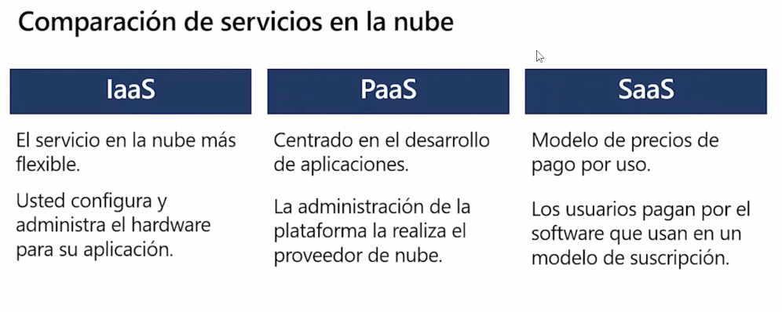
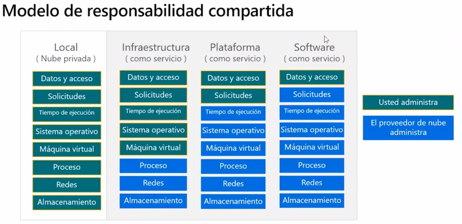
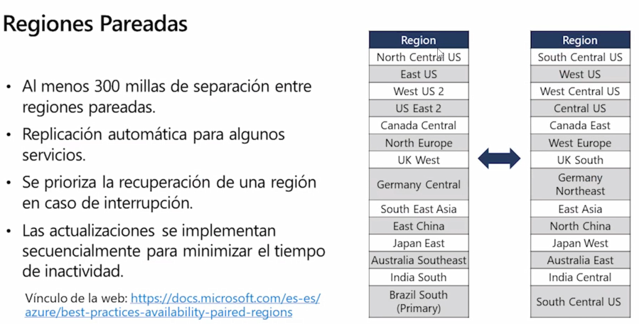
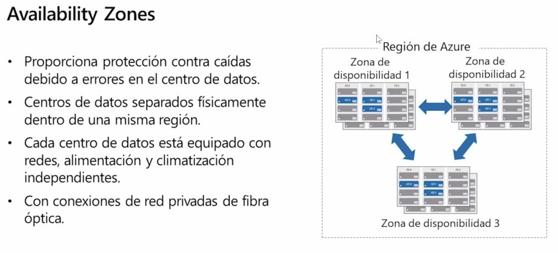
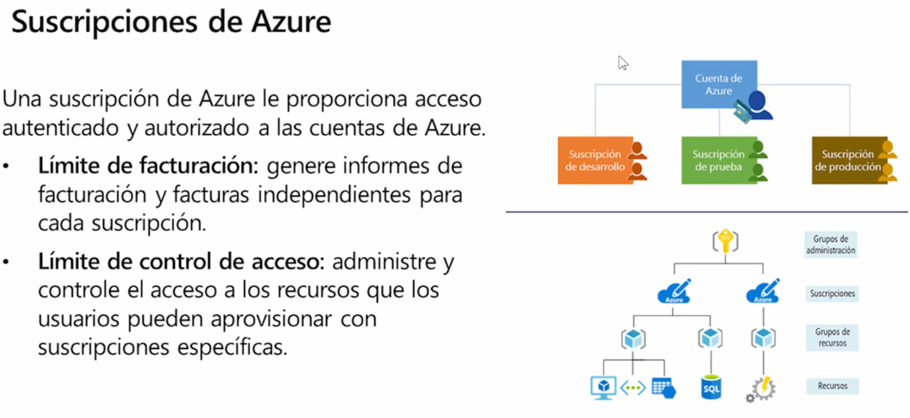
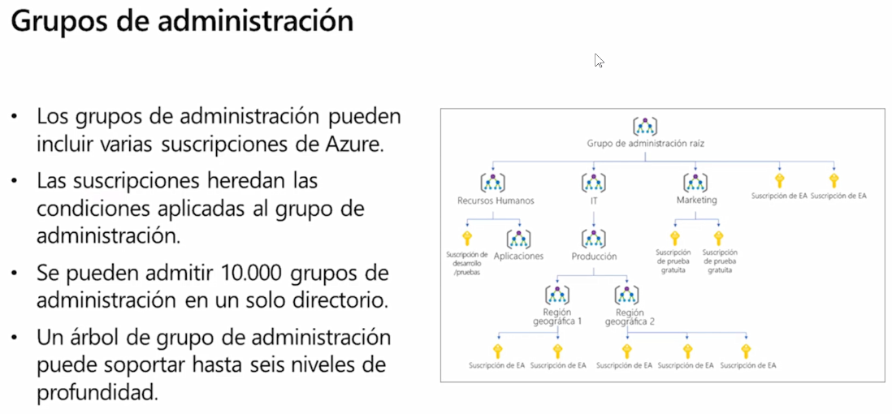

# Presentación

- 👋 Hola, Soy @MartinFacorro
- 👀 Me interesa muchísimás cosas, dentro de la tecnología, soy un programador apasionado. Me gusta mucho trabajar en equipo, observar cómo se trabaja y entender el valor del capital humano. En otros ordenes de la vida, me gusta mucho la lectura, no puedo vivir sin estar con un libro en la mano. Su tuviese que recomendar un libro, ese seria "El Mundo de Sofia" una novela de Jostein Gaarder.
- 🌱 Actualmente estoy aprendiendo sobre la nube por supuesto, y continuamente aprendiendo sobre temás de desarrollo.
- 💞️ Estoy buscando colaborar en la comunidad de Desarrolladores.
- 📫 Cómo llegar a mí, podras encontrarme en:
  - Twitter <a href="https://twitter.com/FacorroMartin"> @FacorroMartin </a> 
  - LinkedIn <a href="https://www.linkedin.com/in/martin-facorro/"> Martin Facorro </a>
  - Facebook <a href="https://www.facebook.com/profile.php?id=100080665428602"> Martin Facorro </a>
  - Instagram <a href="https://www.instagram.com/facorro.martin/"> Martin Facorro </a>
  - Github <a href="https://github.com/MartinFacorro"> Martin Facorro </a>

# Preparación Azure AZ-900 español

En este camino del aprendizaje, mientras lo recorro, quiero compartir aquellos recursos que me sirven al momento de prepararme.

El objetivo es dar un aporte para vuestros caminos.

Como primer ítem a compartir. Como cada documentación que uno requiera recorrer, el mejor lugar donde encontrar información es en el site oficial.
Por lo que para iniciar el primer lugar para visitar es el siguiente: <a href="https://docs.microsoft.com/es-mx/learn/azure/"> Azure en Microsoft Learn | Microsoft Docs</a>

A saber, el examen de AZ-900 consta de los siguientes temás.
Este examen incluye seis áreas de dominios de conocimiento:

|                                **Área de domínio AZ-900**                | **Peso**              |
|--------------------------------------------------------------------------|-----------------------|
|                  Descripción de los conceptos de la nube                 | 20-25 %               |
|              Descripción de los servicios básicos de Azure               | 15-20 %               |
|Descripción de las principales soluciones y herramientas de administración de Azure | 10-15 %     |
| Descripción de las características de seguridad general y de seguridad de red | 10-15 %          |
|Descripción de las características de identidad, gobernanza, privacidad y cumplimiento | 20-25 %  |
|Descripción de los Acuerdos de Nivel de Servicio y la administración de costos de Azure | 10-15 % |

#  Módulo 1 Conceptos de la nube

**cómputo en la nube**: prestación de servicios de cómputo a través de internet, permite el acceso bajo demanda a un grupo de recursos. Permite innovación más rápida, recursos flexibles y costos regulables.

## Modelos en la nube

### Nube privada

- Centro de datos propio
- La organización es responsable de operar los servicios que brinda.
- No proporciona accesos ajenos a la organización.

### Nube Publica

- Propiedad del Cloud Services o proveedor de hosting
- Proporciona recursos y servicios a múltiples organización y usuarios.
- Se accede a través de una red segura(por lo general internet).

### Nube hibrida

- Combina la nube publica con la privada.
- Permite la ejecucion de aplicaciones de manera más adecuada.
- Se adecua, con legislaciones o regulaciones de información sensible, para que se mantenga en ubicaciones on-premise.

## Beneficios de la nube

- **Alta disponibilidad**: Capacidad que tienen las infraestructuras para mantenerse funcionando la mayor cantidad de tiempo posible, sin perjudicar la operación.

- **Tolerancia a fallos**: Capacidad de responder a una falla, sin generar la caída completa de los sistemás.

- **Escalabilidad**: Capacidad de agregar instancias o crecer verticalmente, por ejemplo, en la cantidad de máquinas virtuales para operar un sistema. (se realiza de forma manual o automática)

- **Elasticidad**: Capacidad de crecer horizontalmente, en este caso se incrementan los recursos de cómputo a un servicio o sistema. (se realiza de forma manual o automática)

- **Alcance global**: Esta relacionado con las capacidades de latencia por el lado del cliente. Relacionado a regiones, países. 

- **Capacidades de latencia del cliente**: Permite levantar servicios en la ubicación geográfica más cercada, en donde los usuarios los estan consumiendo.

- **Agilidad**: Capacidad de generar o eliminar un recurso, un sistema de manera rápida y eficiente en el momento que lo creamos conveniente.

- **Consideraciones de costos predictivo**: Calculadora de costos, costos de capital.

## Costos de capital (Capex) (modelo on-premise)

- Gasto inicial de dinero en infraestructura física.
- Costos derivados de CapEx tienen un valor que se reduce con el tiempo.

## Gastos Operativos (OpEx)

- El gasto y la facturación en servicios o productos según sea necesario.
- Los gastos se deducen el mismo año.

## Modelo basado en el consumo

Los usuarios finales solo pagan por los recursos que utilizan.

- Mejor predicción de costos.
- Se proporcionan precios para recursos y servicios individuales.
- La facturación se basa en uso real.

## Servicios en la nube

### **Infraestructura como Servicio: (IaaS)**

Estructura más básica, el proveedor se ocupa de la planta física, de la seguridad, seguridad de red, proveen los servidores y almacenamiento.

### **Plataforma como servicio  (PaaS):**

Proporciona un entorno para desarrollar, probar e implementar aplicaciones, sin centrarse en la administración de la infraestructura subyacente.

Se utiliza para poder desarrollar, implementar software, si preocupaciones sobre la infrastructura.

### **Software como Servicio (Saas):**

Los usuarios usan aplicaciones basadas en la nube y se conectan a ellas a través de Internet. Algunos ejemplos: Microsoft 365, correo electrónico, calendario. Aplicaciones 100% en la nube.

### Modelo de Responsabilidad compartida.

La responsabilidad de acceso y de datos siempre es responsabilidad del cliente.

### Comparación de servicios en la nube

### Modelo de Responsabilidad compartida

### ServerLess o cómputo sin servidor

Con el modelo de cómputo sin servidor, el proveedor de servicios en la nube otorga, escala y administra de manera automática, la infraestructura para ejecutar el código.

**Azure Functions: (Se necesita un desarrollador)** 

 

Funciones que se ejecutan como servicios. Ejecución en tiempo real, donde se crea el recurso, se utiliza y se desecha. La VENTAJA es el costo, ya que se paga por lo que se consume.  Las funciones se usan normalmente cuando se debe realizar un trabajo en respuesta a un evento (a menudo a través de una solicitud REST), un temporizador o un mensaje de otro servicio de Azure, y cuando ese trabajo puede completarse rápidamente, en segundos o en menos tiempo.

Ventajas:

- En lugar de escribir una aplicación completa, el desarrollador crea una función, la cual contiene código y metadatos sobre sus desencadenadores y enlaces. La plataforma programa automáticamente la función para que se ejecute y escala el número de instancias de proceso según la tasa de eventos de entrada.
- Permite código más productivo.
- Leguajes de desarrollo como C#, F#, Node.js, Java o PHP.
- Pagar solo por el tiempo en que Azure Functions esta en ejecución.

**Azure Logic Apps: (No requiere desarrollador)** 

Las aplicaciones lógicas ejecutan flujos de trabajo diseñados para automatizar escenarios empresariales y compilados a partir de bloques lógicos predefinidos. Todos los flujos de trabajo de aplicación lógica de Azure comienzan con un desencadenador, que se activa cuando se produce un evento específico o cuando hay nuevos datos disponibles que cumplen determinados criterios. Con el lanzamiento de un desencadenador, el motor de Logic Apps crea una instancia de aplicación lógica que ejecuta las acciones del flujo de trabajo.

Estas acciones también pueden incluir conversiones de datos y controles de flujo, como instrucciones condicionales, instrucciones "switch", bucles y bifurcaciones.

Los flujos de trabajo se conservan como un archivo JSON con un esquema de flujo de trabajo conocido.

Azure Logic Apps es un servicio sin código o de poco código, no se necesitan desarrolladores. Un profesional de la nube o de TI debe pueden compilar y dar soporte a este flujo de trabajo.

**Comparación entre Functions y Logic Apps**

Functions y Logic Apps pueden crear orquestaciones complejas. Una orquestación es una colección de funciones o pasos que se ejecutan para realizar una tarea compleja.

- Con Functions, se escribe código para completar cada paso.
- Con Logic Apps, se usa una GUI para definir las acciones y cómo se relacionan entre sí.

Puede mezclar y combinar servicios cuando crea una orquestación, llamando a las funciones desde las aplicaciones lógicas y viceversa. Aquí se indican algunas diferencias comunes entre las dos.

# Módulo 2 Conceptos de la nube

## Componentes de Arquitectura

### Regiones

Es un conjunto de centros de datos, cada region tiene mas de un data center. Esto permite flexibilidad para los usuarios, ya que reduce la latencia para los clientes. Pudiendo elegir las zonas de mayor proximidad. Las regiones y zonas de disponibilidad de Azure están diseñadas para ayudarle a lograr resistencia y confiabilidad en las cargas de trabajo críticas para la empresa.

Zonas de disponibilidad
Las zonas de disponibilidad de Azure son ubicaciones separadas físicamente dentro de cada región de Azure y toleran los errores locales. Estos errores pueden abarcar desde errores de software y hardware hasta eventos como terremotos, inundaciones e incendios. La tolerancia a los errores se logra gracias a la redundancia y el aislamiento lógico de los servicios de Azure. Para garantizar la resistencia, se configuran un mínimo de tres zonas de disponibilidad independientes en todas las regiones habilitadas.
Estas zonas de disponibilidad de Azure se conectan mediante una red de alto rendimiento que cuenta con una latencia de ida y vuelta inferior a 2 milisegundos. Asimismo, le ayudan a sincronizar los datos y a mantenerlos accesibles cuando las cosas van mal. Cada zona consta de uno o varios centros de datos equipados con una infraestructura de alimentación, refrigeración y redes independientes. Las zonas de disponibilidad están diseñadas de manera que, si se ve afectada una zona, los servicios regionales, la capacidad y la alta disponibilidad serán compatibles con las dos zonas restantes.

Cada centro de datos se asigna a una zona física. Las zonas físicas se asignan a zonas lógicas de la suscripción de Azure. A las suscripciones de Azure se les asigna automáticamente esta asignación en el momento de crear una suscripción.

**Regiones Pareadas** a traves La norma ISO22000 habla de la continuidad de negocios y recuperacion de desastres.
para cada region, existe una region par, a menos de 300 millas de distancia de la region original. Esto existe, para que haya replicación pares. Así ante un eventual caída, se recupere la información de la region par.

### Zonas de disponibilidad

### Recursos principales

Los recursos de Azure son los componentes como almacenamiento, maquinas virtuales,  y redes que estan disponibles para crear soluciones en la nube.

1. Maquinas Virtuales.
2. Cuentas de almacenamiento.
3. Redes Virtuales.
4. App Services.
5. SQL Database.
6. Funciones.

### Azure Resources Manager

### Suscripciones

Para crear y usar los servicios de Azure, necesita una suscripción de Azure. Cuando trabaje con aplicaciones y necesidades empresariales propias, tendrá que crear una cuenta de Azure y se creará una suscripción de forma automática. Después de crear una cuenta de Azure, puede crear suscripciones adicionales.

### Grupos de Administracion

Los **grupos de recursos** son contenedores logicos, para administrar recursos. Los grupos de recursos permiten no tener que estar eliminando cada recuros.

Cada recurso puede pertenecer solo a un grupo de recursos. Los recursos pueden estar en distintas regiones dentro de un mismo grupo de recursos.

Se puede tener hasta 10mil niveles de administración, y 6 niveles.

### cómputo (Azure Compute Services)

Es el servicio mas utilizado. Es un servicio de computo bajo demanda que proporciona recursos de computo como discos, procesadores, memoria, redes y sistemas operativos.

#### Maquinas virtuales

Las maquinas virtuales de Azure, son emulaciones basadas en software de equipos fisicos:

- Incluye un procesador virtual, memoria, almacenamiento y redes.
- Oferta de la IaaS que proporciona un control y una personalizacion total.

Al utilizar un cliente de escritorio remoto, puede usar y controlar la máquina virtual como si se estuviera sentado delante de ella.

#### Servicio de Aplicaciones (Application services)

Azure App Services es una plataforma totalmente administrada para crear, implementar y escalar aplicaciones web, y APIs rapidamente:

- Compatible con .NET, .NET Core, Node.js, Java, Python o PHP.
- Oferta de PaaS con requisitos de cumplimineto, seguridad y rendimiento de nivel empresarial.
- Puede satisfacer los exigentes requisitos de rendimiento, escalabilidad, seguridad y cumplimiento mientras usa una plataforma totalmente administrada para realizar el mantenimiento de la infraestructura. App Service es una oferta de plataforma como servicio (PaaS).

**Tipos de servicios de aplicaciones**

Con App Service, puede hospedar la mayoría de los estilos de servicio de aplicación más comunes, como los siguientes:

- Aplicaciones web: compatibilidad completa para hospedar aplicaciones web mediante ASP.NET, ASP.NET Core, Java, Ruby, Node.js, PHP o Python. Puede elegir Windows o Linux como sistema operativo del host.
- Aplicaciones de API: puede compilar API web basadas en REST mediante el lenguaje y el marco que prefiera. Se obtiene compatibilidad completa con Swagger y la posibilidad de empaquetar y publicar la API en Azure Marketplace. Las aplicaciones producidas se pueden consumir desde cualquier cliente basado en HTTP o HTTPS.
- Trabajos web: Se puede usar la característica WebJobs para ejecutar un programa (.exe, Java, PHP, Python o Node.js) o un script (.cmd, .bat, PowerShell o Bash) en el mismo contexto que una aplicación web, aplicación de API o aplicación móvil. Los puede programar o ejecutar un desencadenador. Los trabajos web suelen usarse para ejecutar tareas en segundo plano como parte de la lógica de aplicación.
- Aplicaciones móviles: Use la característica Mobile Apps de App Service a fin de compilar rápidamente un back-end para aplicaciones iOS y Android. Con unos pocos clics en Azure Portal, puede realizar lo siguiente:

- Almacenar los datos de aplicaciones móviles en una base de datos SQL basada en la nube.
- Autenticar a clientes con proveedores sociales comunes, como MSA, Google, Twitter y Facebook.
- Enviar notificaciones de inserción.
- Ejecutar lógica de back-end personalizada en C# o Node.js.

En el lado de la aplicación móvil, hay compatibilidad con el SDK para aplicaciones nativas de iOS y Android, Xamarin y React.

App Service controla la mayoría de las decisiones sobre la infraestructura que se tratan en el hospedaje de aplicaciones accesibles desde la web:

- La implementación y administración se integran en la plataforma.
- Los puntos de conexión se pueden proteger.
- Los sitios se pueden escalar rápidamente para controlar cargas de tráfico elevado.
- El equilibrio de carga integrado y el administrador de tráfico proporcionan alta disponibilidad.

Todos estos estilos de aplicación se hospedan en la misma infraestructura y comparten estas ventajas. Esto convierte a App Service en la elección ideal para hospedar aplicaciones orientadas a la web.

#### Contenedores (Azure Container Services)

Los contenedores de Azure son un entorno virtualizado ligero que no requiere administracion del sistema operativo y puede responder a los cambios bajo demanda:

- **Azure Container Instances**: una oferta de PaaS que ejecuta un contenedor en Azure son la necesidad de administrar una maquina virtual o servicios adicionales.
- **Azure Kubernetes Services**: un servicio completo con arquitecturas distribuidas y grandes volumenes de contenedores.

Los contenedores son una excelente opción si quiere ejecutar varias instancias de una aplicación en un solo equipo host.

#### Escritorio Virtual de Windows

Windows Virtual Desktop es la virtualización de aplicaciones y escritorios que se ejecuta en la nube:

- Cree un entorno de virtualizacion de escritorio completo sin tener que ejecutar servidores de puerta de enlace adicionales.
- Publique grupos de hosts ilimitados para adaptarse a diversas cargas de trabajo.
- Reduzca los costos con recursos agrupados para multiples sesiones.

Azure Virtual Desktop proporciona administración centralizada de la seguridad de los escritorios de los usuarios con Azure Active Directory (Azure AD). Puede habilitar la autenticación multifactor para proteger los inicios de sesión de los usuarios. También puede proteger el acceso a los datos mediante la asignación a los usuarios de controles de acceso basados en roles (RBAC) detallados.

Los datos y las aplicaciones se separan del hardware local y se ejecutan en un servidor remoto. Se reduce el riesgo de dejar los datos confidenciales en un dispositivo personal.

Las sesiones de usuario están aisladas en entornos de una o varias sesiones.

### Redes

Incluye una gama de opciones para conectar el mundo exterior a servicios y características de los centros de datos globales de Azure.

#### Azure Virtual Network (VNet)
Permite que los recursos de Azure se comuniquen entre si, con internet y con redes locales.

#### Virtual Private Network Gateway (VPN)

Se usa para enviar tráfico cifrado entre una red virtual de Azure y una ubicacion local a través de la internet pública.

#### Azure Express Route

Extiende las redes locacles hacia Azure a traves de una conexion privada que facilita un proveedore de conexion.

### Almacenamiento (Azure Storage Services).

#### Contenedores de almacenamiento (Blob Storage)

#### Disk Storage

#### Azure Files

#### Niveles de acceso al almacenamiento

### Bases de datos.

#### Azure Cosmos Database

#### Azure SQL Database

#### Azure Database for MySQL

#### Azure Database for PostgreSQL

#### Azure SQL Managed Instance

#### Azure MarketPlace